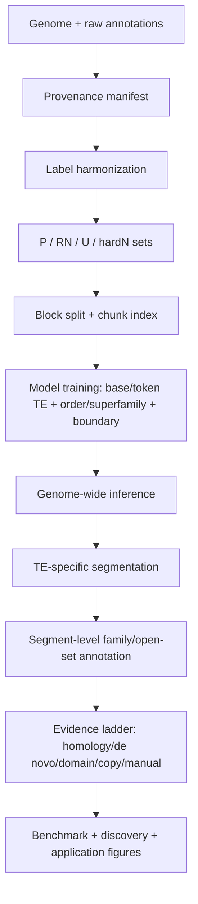
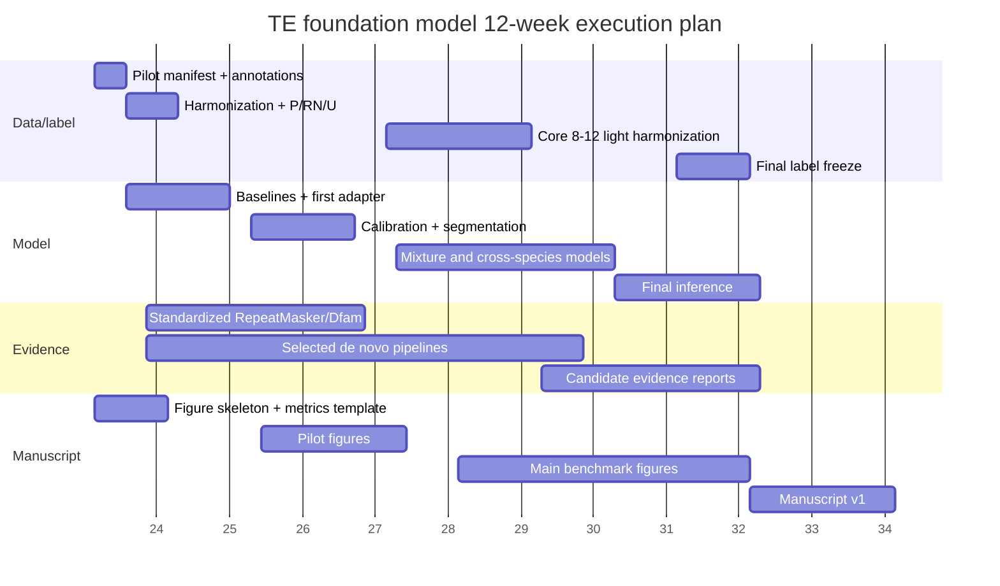

# TE foundation model 实验方案与 Nature Methods 投稿路线图 v4.0

> 版本：v4.0，决策收敛与执行版  
> 目标：把 TE foundation model 项目从“可做的实验集合”收敛为“可执行、可并行、可停损、可投稿 Nature Methods 档位”的实验路线。  
> 核心判断：整体思路是可行的，但不能把资源投入到“所有物种全流程重注释 + 全模型全窗口全指标”这种重型控制上。第一阶段必须用 **pilot 最小闭环** 证明标签体系、模型信号、segmentation、P/RN/U 评估和 evidence ladder 都成立；full de novo annotation pipeline 只作为并行证据轨，不作为主线阻塞项。

---

## 0. 一句话结论

这篇文章不能定位成“把 DNA foundation model 微调用来做 TE 二分类”。更稳、更接近 Nature Methods 档位的定位应是：

> **TE 注释是一个标签不完备、跨物种、层级分类、open-family、repeat-resolution 的 genome segmentation 问题。我们建立一个可复现的 TE annotation framework：将异质标签 harmonize 为 P/RN/U 体系，训练 token/base-level TE 与 order/superfamily 模型，经过 TE-specific segmentation 得到可校准 segment，再用 segment-level family/open-set/evidence 模块处理 known family、unknown family 和候选 novel TE。**

因此，实验路线应围绕“方法框架是否可靠、是否泛化、是否能发现数据库漏注、是否可复现、是否节省资源”展开，而不是围绕“我们是否把所有可能标签源都重新跑一遍”。

---

## 1. 当前方案的可靠性与可行性总评

| 模块 | 可行性 | 主要风险 | 是否必须现在做 | 建议 |
|---|---:|---|---|---|
| 三轨标签输入：已有注释、标准化 homology evidence、de novo/structure evidence | 高 | 来源异质、版本混乱、冲突标签 | 必须 | 做，但分层记录 provenance，不把任一来源当绝对真值 |
| Harmonization + P/RN/U | 高 | 规则太复杂导致返工 | 必须 | 第一周冻结 v0.1 规则；后续只允许版本化修改 |
| 全物种 full de novo TE pipeline | 中低 | 时间长、内存高、失败率高、收益不确定 | 不应作为主线 | 只对 3–4 个 pilot 并行跑；大基因组暂缓 |
| Window/chunk index | 高 | 随机 split 泄漏同源 copy | 必须 | 按 chromosome/block split，训练时动态抽 chunk |
| Base/token-level TE segmentation | 高 | 预测碎片化、边界不稳 | 必须 | 先 threshold+merge，再 HMM/CRF/boundary-aware ablation |
| Superfamily/order head | 中高 | Unknown/missing label 多 | 必须但只做粗层级 | 先做 order/superfamily；family 不要放 token-level 主模型 |
| Segment-level family/open-set | 中 | family 标签噪声、nested TE | 第二阶段必须 | 只用高纯度 segment 训练，open-set 用 prototype/evidence |
| Cross-species / cross-kingdom | 中高 | 远缘泛化可能下降 | 必须 | 不强行声称 universal；下降也可解释为 evolutionary-scale transfer |
| Novel TE discovery | 中 | 容易被审稿人质疑是假阳性 | 必须谨慎 | 只声明 evidence-supported unannotated candidates，不轻易叫 novel family |
| Assembly/annotation score | 中 | 与主方法距离较远 | 后期 | 可作为应用 case，不要阻塞模型主线 |

**总体可行性：高。** 关键前提是把 heavy pipeline 从“必要前置条件”降级为“并行证据轨”，并用明确 gate 决定是否扩大规模。

---

## 2. Nature Methods 档位需要补齐的三件事

Nature Methods 这一档更关心“方法是否可被领域使用、验证是否全面、是否有可复现技术描述、是否能应用到重要生物问题”。因此主文不能只展示 AUROC 或单物种提升，而要给出以下三层证据。

### 2.1 方法层贡献

必须让审稿人看到这个方法不是简单模型微调，而是解决 TE annotation 的核心难点：

1. 异质标签来源如何变成可审计训练标签；
2. 未注释区域如何不被错误当作 negative；
3. Unknown / missing family / simple repeat 如何处理；
4. 模型输出如何从 token/base probability 变成 segment-level annotation；
5. known family、unknown family 和新候选如何区分；
6. 跨物种泛化是否真实，而不是复制数据库；
7. 与 RepeatMasker/Dfam/de novo 工具相比是否有互补价值。

### 2.2 验证层贡献

至少需要以下验证矩阵：

| 验证问题 | 必要实验 |
|---|---|
| 模型是否学到 TE signal | pilot binary + one-hot/CNN baseline + frozen encoder baseline |
| 标签体系是否必要 | random negative vs RN/hard negative；light vs full priority ablation |
| 是否只是复制 Dfam | human-only Dfam baseline、species-specific Dfam baseline、database holdout/family holdout |
| 是否能跨物种 | human-only → non-human；animal-only → plant/fungi；taxonomy-balanced universal |
| 是否能输出可用注释 | segment F1、fragmentation、over-merge、boundary error、GFF3/BigWig 输出 |
| 是否能发现漏注 | high-confidence U candidates + de novo/structure/domain/copy evidence + manual panel |
| 是否可复现可运行 | manifest、容器、workflow、runtime、memory、release examples |

### 2.3 应用层贡献

建议选择 1–2 个强 case，而不是铺太多：

- **Case A：annotation incompleteness recovery。** 在高质量基因组中找出数据库漏注但有多证据支持的 TE segments。
- **Case B：cross-species annotation transfer。** 在注释质量弱的物种中比传统工具更稳定，且 RN-FPR 可控。
- **Case C：assembly / repeat-resolution QC。** 后期可选，用 TE segment continuity、nested structure、copy consistency 辅助评价 assembly 或不同 assembly 版本。

---

## 3. 最小可发表闭环：先做这个，不要先做满配

第一阶段目标不是“最好模型”，而是证明整个框架成立。

### 3.1 Pilot species

推荐 4 个 pilot：

| 物种 | 角色 | 为什么选 |
|---|---|---|
| human hg38 或 T2T-CHM13 | 哺乳动物、高质量注释、benchmark 主线 | 注释源多，能做 Dfam/RepeatMasker/hg19-hg38-T2T case |
| rice | 植物、TE 丰富、EDTA/HiTE 友好 | 植物 TE 结构明显，能测试跨 kingdom |
| Drosophila 或 C. elegans | 小动物、远缘泛化、计算友好 | 运行快，适合 ablation |
| 一个真菌，例如 Neurospora / yeast / Magnaporthe | 低 TE 或不同 TE landscape | 作为低 repeat / 非典型景观控制 |

### 3.2 第一阶段必须产出的 8 个文件/结果

```text
1. species_manifest.yaml
2. raw_repeat_records.tsv.gz
3. harmonized_repeat_records.tsv.gz
4. P_TE.bed.gz / RN.bed.gz / U.bed.gz / hard_negative.bed.gz
5. chunk_index.parquet
6. p_TE.bigWig / p_order.bigWig / boundary.bigWig
7. segments.filtered.bed / segments.superfamily.gff3
8. label_qc.html / prediction_qc.html / evaluation_summary.tsv
```

只要这 8 个结果能在 4 个 pilot 上稳定生成，项目主线就成立。

---

## 4. 最终实验流程



### 4.1 数据层

核心原则：**标签来源可以异质，但进入模型前必须统一成可审计记录。**

推荐三轨：

| Track | 内容 | 用途 | 是否训练真值 |
|---|---|---|---|
| A. Reference annotation seed | UCSC rmsk、curated TE、官方 RepeatMasker、社区注释 | 快速建立 known TE seed | 高置信部分可作为 P |
| B. Standardized homology evidence | 固定版本 RepeatMasker + Dfam/FamDB；human-only / species-specific / custom library | 可比 evidence；证明模型不是复制数据库 | 不直接覆盖 Track A，只作为 evidence |
| C. De novo / structure evidence | EDTA、HiTE、EarlGrey、RepeatModeler2、structure/domain/copy evidence | 支撑 U 区域候选和 label priority ablation | 仅高证据进入 weak/medium positive 或 discovery |

### 4.2 标签层

每条 raw annotation 必须变成一条 harmonized record：

```text
chrom, start, end, strand
raw_source, raw_id, raw_repName, raw_repClass, raw_repFamily
normalized_order, normalized_superfamily, normalized_family
source_confidence
is_TE, is_nonTE_repeat, is_unknown_TE, is_conflict, is_nested
use_for_binary
use_for_order_or_superfamily
use_for_family
use_for_open_set_or_discovery
loss_weight
```

### 4.3 P/RN/U 定义

```text
P = high-confidence TE positive
RN = reliable negative，不与任何 TE / repeat / blacklist / low-confidence repeat / U-candidate overlap
U = unannotated or uncertain，不当 negative
hardN = simple repeat / low complexity / satellite / tandem / problematic repeat-like negative
```

关键规则：

- Unknown 不等于 negative。
- Missing family 不等于 useless。
- Simple repeat / low complexity / satellite 默认不是 TE positive，而是 hard negative 或 nonTE-repeat。
- Family 训练只用 known、high-confidence、non-nested、segment-pure 的子集。
- U 区域模型高分只能叫 candidate，不能直接叫 novel TE。

---

## 5. 哪些实验优先级低或过度控制

你对“自己跑一遍注释全流程可能前期就要一周”的担心是对的。这个任务可以做，但不应作为主线阻塞。

### 5.1 应该立刻做的 P0

1. 冻结 pilot species 和 assembly。
2. 建立 manifest、label map、harmonization 规则。
3. 从已有注释生成 P/RN/U/hardN。
4. 生成 4 kb 主 chunk index 和 block split。
5. 训练 cheap baseline 与第一版 DNA-FM adapter/LoRA 模型。
6. 做 RN-FPR、hardN-FPR、segment F1、fragmentation。
7. 生成 first-pass segment BED/GFF3。

### 5.2 应该并行做但不阻塞主线的 P1

1. pilot species 的 standardized RepeatMasker/Dfam。
2. 1–2 个 pilot 的 EDTA/HiTE/EarlGrey。
3. HMM/CRF segmentation 后处理。
4. human-only Dfam baseline。
5. label priority ablation。
6. RC consistency 与 calibration。

### 5.3 第二阶段做的 P2

1. 扩展到 8–12 个 core species 的 light harmonization。
2. 90:10、70:30、taxonomy-balanced sampler。
3. Segment-level family/open-set module。
4. Evidence-supported U candidates。
5. Manual curation panel。
6. Final runtime and reproducibility benchmark。

### 5.4 暂缓或只做补充的 P3

| 实验 | 为什么暂缓 | 什么时候再做 |
|---|---|---|
| 所有物种 full de novo pipeline | 成本高、失败率高、标签规则未冻结前容易返工 | pilot 证明 de novo evidence 明显提升后 |
| 大基因组全量 EDTA/HiTE/EarlGrey | 可能周级计算，且主问题不是大规模工程 | 主模型稳定、只挑 1 个展示 case |
| 一开始比较很多 foundation models | 变量太多，难以解释 | 固定标签和评估后再做模型 benchmark |
| 32 kb/50 kb 长上下文全量训练 | 显存和时间大，收益未证明 | 4 kb/8 kb learning curve 后再做 auxiliary |
| token-level family classifier | family 需要长 segment 与 consensus，token 太局部 | segment module 后再做 |
| 全面 assembly score | 与主方法关系较远 | 作为后期 application figure |
| 大规模人工验证 | 人力成本高，统计设计难 | 先做 stratified manual panel |

---

## 6. 模型路线

### 6.1 第一轮只保留 3 个模型

| 模型 | 用途 | 优先级 |
|---|---|---|
| Model A：DNA foundation model + LoRA/adapter + token/base head | 主模型 | P0 |
| Model B：one-hot CNN/SpliceAI-like baseline | 廉价强基线，证明 DNA-FM 有必要 | P0 |
| Model C：frozen encoder + U-Net/head | 测试预训练 embedding 是否足够 | P1 |

暂时不要同时上很多大模型。先把 label、sampler、segmentation、evaluation 走通。

### 6.2 输出层

主模型输出：

```text
p_TE(base/token)
p_order_or_superfamily(base/token | TE)
p_boundary_start(base/token)
p_boundary_end(base/token)
uncertainty / RC_consistency
```

不建议第一版输出 token-level family。Family 放到 segment-level：

```text
candidate segment sequence
+ pooled embedding
+ length / score / boundary / order summary
+ Dfam/domain/de novo/copy evidence
→ known family probability
→ nearest prototype distance
→ open-set score
→ evidence tier
```

### 6.3 Loss 设计

```text
L = L_binary_TE
  + λ1 * L_order_or_superfamily
  + λ2 * L_boundary
  + λ3 * L_total_variation_or_smoothness
  + λ4 * L_RC_consistency
```

训练细节：

- P vs RN/hardN 用于 binary。
- U/ignore/conflict 不作为普通 negative。
- known order/superfamily 且 purity 足够时才计算 class loss。
- boundary label 用 ±16–32 bp Gaussian/triangular soft label。
- RC augmentation 用于训练；推理时 forward + RC averaging，并保存 consistency。

### 6.4 Window/context 决策

第一版：

```text
primary: 4 kb core, stride 2 kb
auxiliary short: 1–2 kb for small TE / boundary / hard negatives
auxiliary long: 16–32 kb input, loss only middle 4–8 kb core
```

原则：

- window 是输入容器，不是科学输出。
- 主文输出必须是 base/token probability 和 segment-level annotation。
- 不要未验证地超出预训练模型原生 context。
- 长上下文只在 learning curve 显示有必要时加入。

---

## 7. Sampler 与训练数据量

### 7.1 不按 genome size 混合

训练时不要把所有 window 直接混在一起，否则 human、maize 等大基因组会支配训练。推荐 hierarchical sampler：

```text
experiment regime
→ kingdom/clade
→ species
→ label stratum: P / RN / hardN / boundary / U-ambiguous
→ chunk
```

### 7.2 推荐初始 batch composition

Pilot binary：

```text
P: 40%
RN: 25%
hardN: 25%
boundary/U-ambiguous: 10%
```

Core model 可按物种和 class 调整，但 RN 与 hardN 必须保留。

### 7.3 学习曲线

不要一开始全量训练。先做：

```text
D0 = 50k chunks
D1 = 200k chunks
D2 = 1M chunks
D3 = 3M chunks
```

每个数据量固定：

- 同一 pilot species；
- 同一 split；
- 同一 label rules；
- 同一 batch composition；
- 同一 validation/test；
- 尽量 3 seeds 或至少固定 seed。

停止规则：

- 如果 1M → 3M 的 segment F1 提升 < 1%，RN-FPR 不下降，fragmentation 不改善，就不要继续加同类 window。
- 如果 cross-species 仍上升，优先增加物种多样性，而不是增加同物种 window。

---

## 8. Segmentation 与后处理

### 8.1 为什么必须做

只输出 base/token probability 会出现：

- TE 被切成很多短片段；
- long TE 内部低分导致断裂；
- low-complexity 区域假阳性；
- superfamily 在相邻 token 频繁切换；
- nested TE 难以表达；
- segment-level family 和 evidence 无法稳定执行。

### 8.2 三类方法都做，但按顺序

**Method A：threshold + merge。** 快速 baseline。

```text
p_TE > threshold
merge gaps <= 50/100/200/500 bp ablation
remove segments < class-specific min_length
assign order/superfamily by weighted vote
```

**Method B：HMM/CRF smoothing。** 主推方法候选。

```text
states: N, TE_LTR, TE_LINE, TE_SINE, TE_TIR, TE_HELITRON, TE_MITE, TE_UNKNOWN, NONTE_SIMPLE, NONTE_SATELLITE
emission: p_TE × p_order
transition: length prior + switch penalty + hardN exclusion
```

**Method C：boundary-aware segmentation。** 用于边界和过度延展控制。

```text
candidate_start = local maxima near p_TE rising edge
candidate_end = local maxima near p_TE falling edge
segment = argmax integrated p_TE - transition_penalty
```

### 8.3 Segment-level metrics

主文不能只报 AUROC，至少要报：

```text
base/token AUPRC
segment precision/recall/F1
RN-FPR
hard-negative FPR
boundary distance median / P90
fragmentation index
over-merge index
length-stratified recall
superfamily macro-F1
calibration ECE / reliability curve
runtime / throughput
```

---

## 9. Benchmark 与 reviewer 防御实验

### 9.1 必要 baselines

| Baseline | 目的 |
|---|---|
| RepeatMasker + full/specific Dfam | 标准 homology baseline |
| Human-only Dfam | 证明不是复制人类数据库 |
| Species-specific Dfam/custom library | 看模型是否补足 homology 缺口 |
| EDTA / HiTE / EarlGrey / RepeatModeler2 | 作为 de novo/structure evidence，不一定全物种跑 |
| one-hot CNN/SpliceAI-like | 廉价深度学习 baseline |
| frozen DNA-FM + head | 测试 foundation embedding 是否足够 |
| random negative training | 证明 RN/U 处理的价值 |

### 9.2 Human-only Dfam 证据分层

对每个非 human 测试物种，把模型预测分成：

```text
A: overlap human-only RepeatMasker/Dfam
B: not human-only but overlap species-specific Dfam/custom library
C: not homology but supported by de novo/structure/domain/copy evidence
D: model-only; requires manual review, not called novel by default
E: conflicts with RN/blacklist/hard negative
```

Nature Methods 级别文章需要展示 B/C 类的价值，同时证明 E 类可控。

### 9.3 Cross-species 实验矩阵

```text
human-only → mouse/cow/zebrafish/drosophila/rice/fungi
no-human → human
animal-only → held-out animals + plants/fungi
plant-only → held-out plants + animals/fungi
fungi-only → held-out fungi + animals/plants
animals + plants → fungi holdout
universal taxonomy-balanced → all holdout
anchor 90:10
anchor 70:30
```

解释策略：

- 如果跨 kingdom 好，强调通用 TE-like sequence grammar。
- 如果跨 kingdom 下降，不要硬说 universal；改为“transferability is structured by evolutionary scale”，再给 kingdom-specific adapter/calibration。

### 9.4 Annotation incompleteness 实验

必须避免“模型预测不在 annotation 中，所以是假阳性”的逻辑。推荐：

1. Annotation dropout：从已知 TE 中隐藏一部分 family/superfamily，测试模型能否恢复。
2. Future/database holdout：旧库训练/评估，新库或 species-specific evidence 验证。
3. U-candidate evidence ladder：模型高分 U 区域必须经过 homology/de novo/domain/copy/manual 分层。
4. Manual panel：按 evidence tier、score、length、class、species 分层抽样，不只挑最好看的例子。

---

## 10. 并行推进方案

### 10.1 四条工作流并行

| 工作流 | 内容 | 是否阻塞主线 | 负责人角色 |
|---|---|---:|---|
| Stream A：Data/label | manifest、harmonization、P/RN/U、chunk index | 是 | 数据工程/生信 |
| Stream B：Model | baseline、adapter/LoRA、training、inference | 是 | 模型工程 |
| Stream C：Evidence pipelines | RepeatMasker/Dfam、EDTA、HiTE、EarlGrey、domain/copy evidence | 否，除 standardized RM 外 | 生信/集群任务 |
| Stream D：Evaluation/manuscript | metrics、QC、figures、methods text、repo | 是 | 你 + 分析/写作 |

### 10.2 12 周推进表

| 时间 | Stream A：数据标签 | Stream B：模型 | Stream C：证据轨 | Stream D：评估/论文 |
|---|---|---|---|---|
| Day 1–3 | 冻结 pilot；下载 genome/annotation；manifest schema | 搭建训练框架；确定 tokenizer/context | 准备 RM/Dfam/EDTA/HiTE 环境 | 冻结主叙事和 figure skeleton |
| Day 4–7 | 解析 UCSC/RM/GFF3；生成 P/RN/U/hardN；4 kb index | 跑 one-hot baseline 和首个 DNA-FM head | 启动 pilot standardized RM；启动 1–2 个 de novo 长任务 | label QC template；split leakage check |
| Week 2 | 修正 label conflicts；block split | pilot binary；randomN vs RN/hardN | RM/Dfam 继续；de novo 后台 | first evaluation table；go/no-go gate 1 |
| Week 3 | token/base label projection 稳定 | calibration；RC consistency；boundary head | 收集 evidence overlap | threshold+merge vs HMM/CRF 初版 |
| Week 4 | full vs light label priority pilot ablation | superfamily/order head；window ablation 1/2/4/8 kb | human-only Dfam baseline | pilot cross-species heatmap；go/no-go gate 2 |
| Week 5–6 | 扩展 core 8–12 species light harmonization | 90:10、70:30、taxonomy-balanced 训练 | selected standardized RM/Dfam | main benchmark tables；runtime logging |
| Week 7–8 | U candidates、hard negatives refinement | segment-level family/open-set module | de novo/domain/copy evidence 汇总 | manual panel 设计；annotation dropout |
| Week 9–10 | 冻结 final labels v1.0 | final model + learning curve + full genome inference | 补关键 evidence gaps | Figure 1–5 初稿；supplement tables |
| Week 11–12 | release dataset manifest | package inference workflow | package evidence reports | manuscript v1；pre-submission inquiry package |

### 10.3 Mermaid Gantt



注：上面的日期只是模板，可以替换成实际启动日期。重点是依赖关系：full de novo 从 Week 1–2 开始后台跑，但不阻塞 Week 2 的模型训练。

---

## 11. Stop/go gates

### Gate 1：Week 2，标签和首个模型是否成立

通过条件：

- 4 个 pilot 均能生成 P/RN/U/hardN 和 chunk index；
- P/RN/U 在 QC 中没有明显坐标错误或类别错配；
- 首个模型在 held-out block 上优于 random 和 one-hot trivial baseline；
- high-precision threshold 下 RN-FPR 可控；
- hardN 上的假阳性可被识别。

失败应对：优先查 label harmonization、RN 定义、split 泄漏和 hard negative，而不是换大模型。

### Gate 2：Week 4，segment 是否可用

通过条件：

- 能从 p_TE 生成 segment BED/GFF3；
- threshold+merge 与 HMM/CRF 至少有一个方案明显降低 fragmentation；
- boundary error 和 over-merge 可量化；
- window 4 kb 与 8 kb/long-context 有初步比较；
- label priority ablation 能说明 full priority 是否值得扩大。

失败应对：调整 segmentation、boundary loss、calibration，不急着增加物种。

### Gate 3：Week 6，跨物种是否值得主打

通过条件：

- 至少在同 kingdom holdout 中稳定；
- 远缘物种下降时能被 calibration/adapter/sampler 改善；
- human-only Dfam baseline 显示模型有 B/C 类互补预测；
- RN-FPR 没有因跨物种而失控。

失败应对：主叙事从 universal 改为 clade-aware transfer；引入 kingdom-specific adapter。

### Gate 4：Week 8–10，Nature Methods 包装是否够强

通过条件：

- 技术验证、跨物种、ablation、runtime、release 均有稳定结果；
- 至少一个 annotation incompleteness / novel candidate case 有多证据支持；
- 工具输出能被普通用户复现；
- 主图已经能讲完整故事。

失败应对：转向更稳的 Genome Biology / NAR Genomics and Bioinformatics / Bioinformatics / Nature Communications 叙事；不要为了 Nature Methods 强行扩大不可控实验。

---

## 12. 主图设计

### Figure 1：方法总览

内容：三轨输入 → harmonization → P/RN/U → model → segmentation → family/open-set → evidence → output。

信息重点：这不是二分类器，而是 TE annotation framework。

### Figure 2：标签体系与 P/RN/U 的必要性

内容：不同来源 overlap、Unknown/missing family 分布、random negative vs RN/hardN、label priority ablation。

### Figure 3：模型与 segmentation 性能

内容：base AUPRC、segment F1、fragmentation、boundary error、over-merge、calibration。

### Figure 4：跨物种泛化

内容：train regime × test species heatmap、phylogenetic distance plot、90:10 vs 70:30 vs taxonomy-balanced。

### Figure 5：不是复制数据库

内容：human-only Dfam / species-specific Dfam / model prediction 分层堆叠图；B/C/D/E evidence categories。

### Figure 6：生物应用 case

内容：high-confidence U candidates、多证据支持、consensus/copy/domain/structure、manual validation panel。

### Extended Data

- 物种清单与 assembly manifest；
- label ontology；
- window size ablation；
- sampler ablation；
- full de novo pipeline runtime；
- model architecture ablation；
- calibration curves；
- failure cases；
- reproducibility checklist。

---

## 13. 资源与时间估计

### 13.1 数据与证据轨

| 任务 | 小基因组 | 中等基因组 | 3 Gb 级大基因组 | 建议 |
|---|---:|---:|---:|---|
| 下载 + manifest + existing annotation parse | 小时级 | 小时–1 天 | 1 天 | P0 |
| Light harmonization | 小时级 | 小时–1 天 | 1–2 天 | P0/P1 |
| Standardized RepeatMasker/Dfam | 小时–1 天 | 1–3 天 | 数天 | pilot/core selected |
| EDTA/HiTE/EarlGrey/RepeatModeler2 | 小时–2 天 | 1–5 天 | 数天–1 周 | pilot only，后台跑 |
| >10 Gb 超大基因组 full pipeline | 不适用 | 不适用 | 周级 | 暂缓 |

### 13.2 模型轨

| 任务 | 预期时间 | 备注 |
|---|---:|---|
| one-hot/CNN baseline | 小时–1 天 | 必须有 |
| pilot DNA-FM adapter/LoRA | 小时–2 天 | 取决于 GPU 和 context |
| 1M–3M chunk learning curve | 数天–1 周 | 可并行 seeds/data sizes |
| core 8–12 species robust model | 1–2 周 | 先固定 architecture |
| full genome inference | 小时–数天 | 输出 bigWig/GFF3，记录 throughput |

---

## 14. 需要避免的关键错误

1. **把 U 当 negative。** 这是 TE annotation 中最危险的错误，会把数据库不完备变成模型假阳性。
2. **把 Simple_repeat / Low_complexity / Satellite 当 TE positive。** 这些更适合 hard negative 或 nonTE-repeat class。
3. **随机 window split。** TE copies 高同源，随机 split 容易泄漏，必须 block/chromosome split。
4. **只报 AUROC。** Nature Methods 级别需要 segment、boundary、calibration、runtime、cross-species、manual/evidence。
5. **过早做 family token classifier。** Family 需要长 segment 和 consensus，先做 order/superfamily。
6. **全物种 full de novo 阻塞主线。** 这是资源黑洞，应作为证据轨并行。
7. **默认阈值 0.5。** 阈值必须从 validation P/RN 和目标 FDR/RN-FPR 校准。
8. **过度声称 novel。** U 区域高分候选必须经过 evidence ladder。
9. **盲目长上下文。** 先证明 4 kb/8 kb 不够，再加入 16–32 kb core+flank。
10. **把 SegmentNT 当现成 TE 工具。** 只借鉴 semantic segmentation 和 U-Net/upsampling 思想，必须做 TE-specific head/postprocessing。

---

## 15. 立即执行清单

### Day 1

```text
[ ] 冻结 pilot species 和 assembly accession
[ ] 建立 species_manifest.yaml 模板
[ ] 建立 label_harmonization_rules.yaml v0.1
[ ] 建立 raw annotation source list
[ ] 冻结 train/val/test split 规则
```

### Day 2–3

```text
[ ] 下载 genome fasta / fai / chrom.sizes
[ ] 下载或整理已有 repeat annotation
[ ] 解析 UCSC rmsk / RepeatMasker .out / GFF3 / curated BED
[ ] 输出 raw_repeat_records.tsv.gz
[ ] 初版 ontology mapping
```

### Day 4–7

```text
[ ] 生成 harmonized_repeat_records.tsv.gz
[ ] 生成 P_TE / RN / U / hardN / blacklist
[ ] 生成 block_split.bed
[ ] 生成 chunk_index.parquet
[ ] 训练 one-hot baseline
[ ] 启动 first DNA-FM adapter training
[ ] 启动 standardized RM/Dfam 与 selected de novo 后台任务
```

### Week 2

```text
[ ] random negative vs RN/hardN ablation
[ ] first p_TE.bigWig
[ ] first segment BED
[ ] RN-FPR / hardN-FPR / segment F1 summary
[ ] Gate 1 meeting: 是否扩大到 Week 3–4
```

---

## 16. 最终投稿前必须有的材料

```text
code/
  tefm preprocess
  tefm train
  tefm infer
  tefm segment
  tefm annotate-family
  tefm score

configs/
  label_harmonization_rules.yaml
  species_manifest.yaml
  sampler_config.yaml
  model_config.yaml

outputs/
  harmonized labels
  chunk index examples
  model checkpoints or inference weights
  bigWig/GFF3 example output
  evidence reports
  benchmark tables

reproducibility/
  container or conda env
  workflow: Snakemake/Nextflow
  exact command lines
  version logs
  runtime and memory logs
  data availability statement
```

---

## 17. 目前最推荐的决策

1. **保留三轨标签输入，但 full de novo 不做全物种前置。** 这是成本收益比最高的路线。
2. **先做 4 pilot species 的最小闭环。** 先证明可行，再扩展到 8–12 core。
3. **主输出是 base/token probability + segment GFF3，不是 window label。** Window 只用于计算与采样。
4. **主模型做到 binary + order/superfamily + boundary；family 放 segment-level。** 这样更符合 TE 生物学和标签现实。
5. **SegmentNT 只作为思想来源，不作为直接工具。** 写成 TE-specific semantic segmentation。
6. **所有“novel”相关说法降级为 evidence-supported unannotated candidate。** 等 evidence 和 manual panel 足够后再说 novel family。
7. **把 full de novo、长上下文、大基因组、assembly score 都放到并行或后期。** 不让它们拖慢主线。
8. **Nature Methods 叙事核心是 framework + validation + usability。** 不是某一个分数，而是把 TE annotation 的不完备标签问题系统化解决。

---

## 18. 决策记录模板

后续每次改规则都写入这里，避免返工时不知道为什么改。

```text
Decision ID:
Date:
Topic:
Options considered:
Decision:
Reason:
Expected impact:
Rollback condition:
Affected files/configs:
```

示例：

```text
Decision ID: D-001
Date: 2026-xx-xx
Topic: Whether to run full de novo pipelines for all species before model training
Decision: No. Run only selected pilot de novo pipelines in parallel.
Reason: Full de novo can take days to weeks on large genomes and is not required to train first P/RN/U pilot model.
Rollback condition: If label priority ablation shows de novo evidence increases segment F1 or U-candidate validation precision substantially.
Affected files/configs: species_manifest.yaml, evidence_config.yaml, roadmap.md
```

---

## 19. 附：论文主叙事草稿

英文主线：

> Transposable element annotation remains difficult because available labels are heterogeneous, incomplete and biased toward known families, while repeat-like non-TE sequences create challenging false positives. We introduce a foundation-model framework that formulates TE annotation as an incomplete-label, cross-species, open-family genome segmentation problem. The framework harmonizes heterogeneous annotations into auditable positive, reliable-negative and unknown label sets; learns calibrated base/token-level TE and order/superfamily probabilities; converts them into coherent TE segments using TE-specific postprocessing; and assigns segment-level family and open-set evidence. Across species, label-source ablations and database holdouts, the framework improves recovery of known and evidence-supported unannotated TE sequence while controlling false positives in reliable-negative and hard-repeat regions.

中文主线：

> 转座元件注释的难点不只是分类精度，而是标签来源异质、数据库不完备、family 开放集、远缘物种差异和非 TE repeat 假阳性。我们的方法把 TE 注释重新定义为 incomplete-label、cross-species、open-family 的 genome segmentation 问题，建立从标签 harmonization、P/RN/U 评估、foundation model token/base detection、TE-specific segmentation、segment-level family/open-set 到多证据候选验证的一体化框架。

