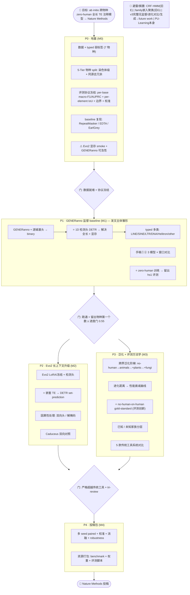

# TE 研究全览流程图 (v1 讨论草案)

> 2026-06-14 蕾姆综合【手稿 + v3/v4 + 03_roadmap + 旧A-H + landscape四队】绘制。
> **这是讨论底板，等待修改**。council / tri-review 待整条思路定稿后再上。
> 在 IDE/网页用 mermaid 渲染查看；⭐=核心创新点，⚠=头号风险，🚫=避雷。

## 一句话故事
首个用基因组基础模型做 **ab initio、跨物种(zero-human)、全长 TE 逐碱基注释 + 检测**的方法，配套填补空白的**跨物种 TE benchmark** → Nature Methods（方法+基准+资源三件套）。

## 主流程

## 图例与纪律
- **四个核心创新点 ⭐**：① 1D 检测头(治全长+显存，超 YORO) ② zero-human 跨物种 ③ Evo2 长上下文吃全长TE ④ no-human gold-standard 可信评测。
- **决策门 {菱形}**：每个门是 go/no-go，不达标不进下一阶段。
- **并行**：P1 稳定后，P2(Evo2升级) 与 P3(泛化+评测) 可并行推进。
- **快速迭代**：Track A(小样本单seed扫架构/窗口) → 晋升 → Track B(scale多seed)；每轮 ≤3 正交方向，exp_id 隔离。
- **backbone 分阶段**：P1 GENERanno 先跑通(好微调、省算力) → P2 Evo2 破长TE死结。

## ⚠ 蕾姆标注的"最该先讨论"的开放点 (待改)
1. **检测式 vs 逐碱基的关系**：P1 同时画了"逐碱基头"和"检测头"，二者是谁主谁辅？是逐碱基为主+检测辅助，还是检测出 box 再转逐碱基评测？——这是架构核心，要定。
2. **手稿①② 与 zero-human 主线可能矛盾**：手稿①写"仅用 human 数据 fine-tune 看物种间泛化"(human训练→外推)，而 zero-human 主线是"排 human 训练→泛化到 human"(排human→内推)。**方向相反**，必须理清这两个到底要哪个、还是分别作不同实验。
3. **zero-human 卖点在 P1(GENERanno短窗) 就能立，还是要等 P2(Evo2长上下文)?**
4. **typed 粒度** 5类够不够；**主指标** per-base vs per-element 谁为先。

## 版本
v1 · 2026-06-14 · 讨论草案 · 待逐点修改后再上 council/tri-review
