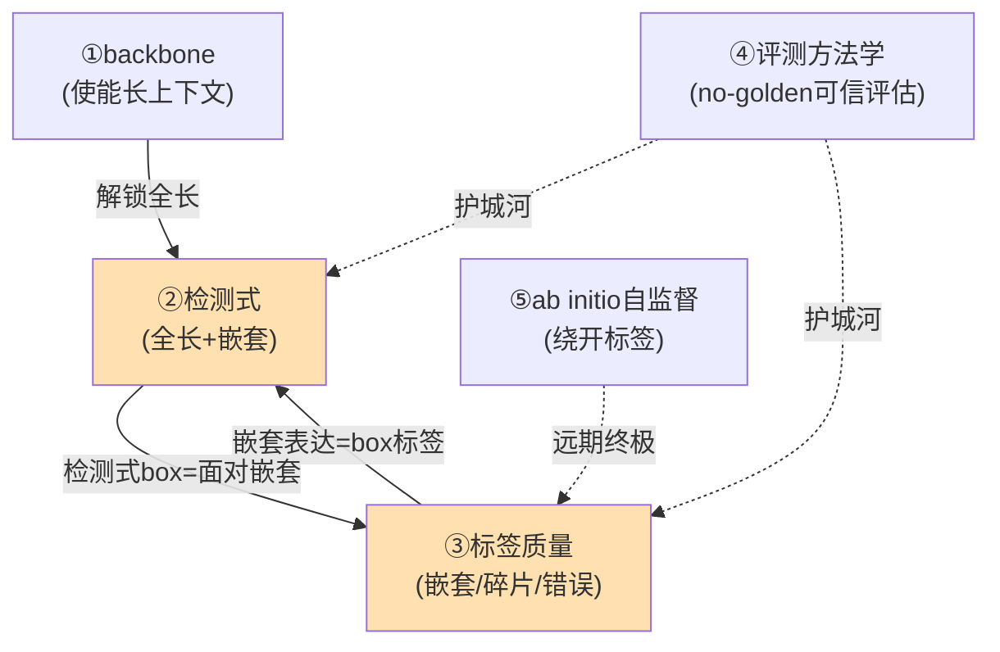
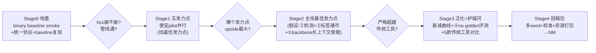

# TE 研究整合 Workflow & 路线图（综合版 v1）

> 2026-06-14 蕾姆综合【旧项目TE_final血泪教训 + 用户5发力点 + 当前代码现实 + landscape调研 + 可复用资产】整合。
> **这是供用户细化的框架底板**，不锁死单一发力点；用户在此之上做更深细化、定最佳发力点。
> 取代早期未含旧项目教训的草稿 `TE_research_plan_v5_unified.md` / `TE_pipeline_overview.md`（保留作参考，不再为主）。
> 回查背景：`reference/te_final_research_history.md`（旧项目历程+避雷）。

---

## 0. 北极星 & 四条铁律（从旧项目血泪提炼，不可违背）
- **北极星**：zero-human 全长 TE 注释模型，**超越传统工具(RepeatMasker/EDTA)**，发 Nature Methods。
- **铁律1 统一评测协议是生命线**：旧项目最大翻车(dm6撤稿)=跨协议比F1。任何比较前先验协议一致。
- **铁律2 早测"远缘崩溃"**：旧项目连远缘动物都崩到F1 0.1。zero-human(哺乳→hs1)必须**第一时间测hs1崩不崩**，别假设泛化半径无限。
- **铁律3 必须真新方法**：旧项目"GENERanno+逐碱基+binary+多物种"做到头也没赢传统工具。**不能复刻旧套路**。
- **铁律4 标签是天花板**：weak label三源不一致~15%卡死上限。模型再强，标签错就白搭。

## 1. 起点：binary baseline = 管线 smoke（= 当前代码，非主线）
- 现状代码：GENERanno-0.5b + 逐碱基token分类 + binary + 1000bp窗 + zero-human 5-Tier split + 评测器(继承旧element指标)。
- **唯一目的**：验证 ① zero-human数据流通不通 ② 管线(build→train→predict→eval)通不通 ③ **hs1留出到底崩不崩(铁律2)**。
- 拿到第一个数即"毕业"，**立刻转向发力点优化，绝不停在1000bp逐碱基binary**(那是旧项目的坑)。

## 2. 五个发力点 + "最便宜验证实验"（找最佳发力点的操作化）
> 用户要"每个发力点研究透彻、找最佳"。方法：每个发力点设计一个**便宜pilot**，谁的upside最大、谁是真新方法、谁耦合最深 → 谁是最佳发力点。

| 发力点 | 上限(做成) | 证据(支持/反对) | 风险 | 最便宜验证pilot | 真新方法? |
|---|---|---|---|---|---|
| **①backbone** | 解锁长上下文吃全长TE | 旧:backbone差<0.03(涨分小);但8192>1000 | 低 | GENERanno **1000bp vs 8192bp 同数据对比**(长窗涨多少召回?) + Evo2冻结探针(zero-shot TE信号有无) | 使能器,非主创新 |
| **②YOLO检测式** | 全长+显存+element+嵌套 | landscape:仅YORO(只做一半);DETR式=空白 | 中高(嵌套建模) | 小数据 **per-base vs 检测头(DETR)** 对比:全长TE召回+嵌套处理 | ✅最高novelty |
| **③标签质量** | 突破天花板(铁律4) | 旧:三源不一致15%=天花板;无golden | 中 | **标签审计pilot**:量化三源不一致率/嵌套率/碎片率 + defragment前后对比 | ✅治本 |
| **④评测方法学** | 无golden下可信评估=护城河 | 旧:dm6翻车根因=评测;手稿⑥ | 中 | **no-human-on-human gold-std pilot**(手稿⑥)+协议一致性自检 | ✅可成方法贡献 |
| **⑤ab initio自监督** | 绕开标签天花板(v3灵魂) | landscape:FM做TE空白;Evo2 down-weight repeat | 最高(机制未验) | **k-mer repeat-score vs Dfam相关性**(v3 MVP-1,2周CPU) | ✅终极但远 |

## 3. ★发力点耦合结构（不能孤立选！）

> 蕾姆开局假设(待验证)：**②检测式 + ③标签 = 核心硬币**(同一枚:嵌套既是检测问题也是标签问题);①backbone是使能器,④评测是护城河,⑤ab initio是远期终极。

## 4. Workflow 阶段流程（路线图）

## 5. 🚫 避雷清单（旧项目已证无效,别再碰）
CRF/BIOES/HMM平滑(无效) · TE-family嵌入聚类(NMI≤0.1废) · 混合训练提升远缘(翻车) · PU-Learning(差) · 跨协议比F1(致命) · 随机窗口split(泄漏) · 停在短窗口逐碱基binary(旧套路).

## 6. ♻️ 可复用资产（别重造）
evaluate_predictions.py(BP级+element级IoU/boundary/fragmentation/merge) · 流式推理(大基因组) · 染色体级split · species_config · phylogenetic ceiling(真发现可做卖点).

## 7. 待用户细化点
- [ ] 确认/调整"②+③核心硬币"假设,还是别的发力点优先?
- [ ] Stage1 五个pilot哪几个先跑/并行几个?
- [ ] backbone:GENERanno长窗(8192) vs Evo2,Stage1 pilot后定
- [ ] 检测式:DETR set-prediction vs anchor-YOLO,嵌套怎么建模
- [ ] 标签:defragment全长金标准从哪来(结构工具?人工curated?)
- [ ] typed粒度/主指标(per-base vs per-element)最终定
