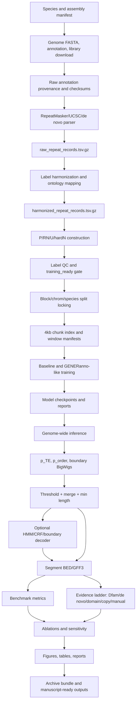

# TE annotation refinement foundation model route

> **归档说明（2026-06-14）**  
> 本文件已被并入 `docs/11_master_plan.md`，之后仅作为英文旧版路线参考，不再作为项目主入口维护。当前 canonical 中文总路线、已确定选择、claim hierarchy、species ladder、指标闸门和下一步动作均以 `docs/11_master_plan.md` 为准。
>
> 重要漂移说明：本文件早期采用 “RepeatMasker-derived TE annotation refinement” 作为主叙事；后续讨论已改为 “raw-genome foundation model TE annotator 为主线，refinement/circularity/evidence audit 为防守层”。继续推进项目时不要直接沿用本文件的 refinement-first wording。

> Date: 2026-06-14  
> Status: route reconstruction draft, based on existing project docs and TEAMS review  
> Scope: publication-oriented technical plan for an ab-initio TE foundation-model project  
> Key boundary: this is **not** full-length TE defragmentation.

## Source Materials Reviewed

This synthesis integrates:

- current v4 plan: `TE_foundation_model_experimental_plan_v4_NatureMethods.md`;
- previous TE project: `/srv/beegfs/scratch/shares/ds4dh/common/TE_benchmark/TE_final/`, especially `PAPER_EXPERIMENT_PLAN.md`, `V6_RESULT_TO_CLAIM.md`, `METRIC_CONTRACT.md`, `A3_postprocess_sweep_results.md`, `HG38_BACKBONE_FINETUNE_EVAL_METRICS.md`, `U2_DL_ONLY_AUDIT.md`, and `W11_RM_FREE_TRADITIONAL_EVAL.md`;
- previous ingest summary: `.backup/docs/inputs/TE_final_ingest_2026-06-12.md`;
- backup strategy, annotation, species, training, roadmap, and artifact docs under `.backup/docs.backup-20260609-235504/`;
- backup model registry under `.backup/pretrained_models/`;
- current framework docs under `docs/`;
- scanned original note: `/home/users/j/jwang/ab-initio-TE/扫描文稿.pdf`.

The scanned note was a one-page image, not text-searchable. The retained ideas are: compare pretrained models and window sizes; evaluate no-human, animal-only, animals+plants, animals+plants+fungi, fungi-only and plants-only regimes; model generalization decay using TE composition and evolutionary distance; judge fragmented annotation with filtering/smoothing such as segment tools, CRF/HMM, and heuristic postprocessing; compare pretrained embeddings before/after fine-tuning; and use PU-learning logic because unannotated regions may contain true TE sequence.

## 0. Executive Decision

The strongest publishable route is:

> Build a foundation-model-assisted framework for **RepeatMasker-derived TE annotation refinement**: starting from existing long TE or TE-like regions/fragments, use sequence context plus initial annotation evidence to recalibrate TE probability, correct local boundaries, repair short internal gaps, reduce unreasonable fragmentation, preserve superfamily/family consistency where evidence supports it, and output reproducible segment-level BED/GFF3 annotations.

This route is stronger than a broad "ab-initio foundation model beats all TE tools" story because prior evidence shows:

- bp-level TE detection can be strong, especially with GENERanno-like single-base tokenization, but bp F1 does not measure annotation quality.
- A cheap `threshold + min_len + merge_gap` postprocess already improves segment IoU substantially; any complex decoder must beat it.
- Broad DL superiority over traditional TE tools is not supported by old TE_final evidence.
- DL-only positives should not be called novel TEs without independent homology, structural, copy, domain, or manual support.
- The real methodological gap is not just classification; it is incomplete labels, circular references, uncertain negatives, and segment-level refinement.

Recommended positioning:

```text
Method paper / resource+pipeline paper:
foundation-model-assisted TE annotation refinement under incomplete labels
```

Candidate venue tier:

- Primary ambition: Nature Methods / Nature Biotechnology / Nature Machine Intelligence if the validation package is strong.
- More realistic strong outlets if evidence is narrower: Nature Communications, Genome Biology, NAR Genomics and Bioinformatics, Bioinformatics.

## 1. Task Definition

### Recommended task name

Use one of:

- **TE annotation refinement**
- **RepeatMasker-derived TE region refinement**
- **TE boundary and fragment consistency correction**
- **Post-processing-aware TE annotation improvement**

Avoid:

- full-length TE defragmentation
- complete TE copy reconstruction
- de novo novel TE discovery
- universal ab-initio TE annotator
- DL broadly outperforms traditional TE tools

### Terminology Table

| Use | Meaning | Avoid | Why |
|---|---|---|---|
| TE annotation refinement | improve existing TE annotation segments | full-length TE defragmentation | implies reconstructing complete insertion events |
| boundary correction | correct start/end coordinates | complete TE reconstruction | too strong and biologically different |
| fragment consistency correction | reduce unreasonable local splits | merge all fragments | would reward overmerge |
| RepeatMasker-derived long TE region refinement | input is existing TE-like calls plus flanks | de novo genome-wide discovery | discovery needs much stronger independent evidence |
| evidence-supported unannotated candidate | high-scoring U region with support | novel TE | model-only positives are not enough |
| segment-level annotation quality | BED/GFF3 usability | bp F1 quality | bp F1 is detection, not annotation |
| P/RN/U/hardN label discipline | incomplete-label handling | positive/negative labels | naive negatives are unsafe in TE annotation |

### Input

For each genome/species:

- genome FASTA, `.fai`, chrom sizes, callable genome mask;
- raw RepeatMasker/UCSC/curated/de novo annotations;
- Dfam/FamDB/custom library metadata;
- candidate long TE or TE-like regions plus flanks;
- P/RN/U/hardN label tracks derived from harmonized evidence.

### Output

Primary outputs:

- `p_TE.bigWig`
- `p_order_or_superfamily.bigWig`
- `boundary_start.bigWig`
- `boundary_end.bigWig`
- `segments.filtered.bed`
- `segments.superfamily.gff3`
- `evaluation_summary.tsv`
- `label_qc.html` / `prediction_qc.html`

The model directly predicts base/token-level probabilities and boundary evidence. Postprocessing converts these tracks into segment-level annotations, using calibrated thresholds, merge/min-length rules, and later optional HMM/CRF/boundary-aware decoders.

### What Counts As Success

A result is successful only if it improves annotation refinement metrics over both:

1. raw RepeatMasker-derived fragments; and
2. the strong cheap baseline `threshold + min_len + merge_gap`.

Core success criteria:

- higher segment IoU F1 at `IoU >= 0.5`;
- better boundary accuracy at `50 bp` / `100 bp`;
- lower fragmentation at fixed over-merge rate;
- improved internal gap repair at controlled false bridge rate;
- controlled RN/hardN false positive rate;
- interpretable family/superfamily consistency on high-confidence segments;
- reproducible BED/GFF3 output with versioned provenance.

### Out Of Scope

- reconstructing all complete TE insertion histories;
- declaring every merged long segment a full-length TE;
- using model-only high-scoring unannotated regions as novel TE claims;
- token-level family classification as a first-stage headline claim;
- full all-species de novo TE pipeline before the first model/evaluation loop.

## 2. Scientific Story

### Core Question

Can a pretrained genome model, when trained under incomplete-label discipline and evaluated with segment-level refinement metrics, improve the biological usability of existing TE annotations beyond raw RepeatMasker-style fragments and simple rules?

### Method Contribution

- A TE-specific incomplete-label framework: P/RN/U/hardN, not naive positive/negative labels.
- A base/token-level foundation-model segmentation model with TE, order/superfamily, boundary, uncertainty, and RC consistency outputs.
- A TE-specific segmentation/postprocessing layer that corrects local boundaries and fragmentation while explicitly penalizing over-merge.
- A segment-level evidence layer for family/open-set interpretation, without overclaiming model-only predictions.

### Data Contribution

- Auditable multi-source TE label harmonization across selected species.
- Versioned raw and harmonized records with source provenance.
- Reliable negative and hard negative tracks, rather than treating unannotated genome as negative.
- A pilot/core species panel designed for fast validation and later zero-human transfer.

### Benchmark Contribution

The benchmark should be a **refinement benchmark**, not a full de novo discovery benchmark:

- raw RepeatMasker fragments as baseline 0;
- cheap rule postprocess as baseline 1;
- foundation-model refinement as candidate;
- traditional/de novo tools as evidence/comparators;
- RM-free structural evidence as circularity sensitivity, not absolute truth.

### Why Foundation Models Are Needed

Simple rules can merge nearby fragments, but they do not see sequence grammar, strand/RC consistency, local boundary motifs, class-specific structure, or hard-negative sequence context. The foundation model is justified only if it adds value in:

- boundary localization beyond merge rules;
- gap repair without over-bridging independent elements;
- RN/hardN specificity;
- superfamily/order consistency;
- cross-species robustness after proper calibration.

If it cannot beat cheap postprocessing on these axes, the model should be downgraded and the project should pivot to a postprocessing/audit pipeline.

## 3. Data And Label System

### Label States

Use four training/evaluation states:

| State | Meaning | Training use |
|---|---|---|
| `P` | high/medium confidence TE positive | positive loss |
| `RN` | reliable negative after subtracting all TE/repeat/uncertain/problematic regions | negative loss |
| `U` | unannotated or uncertain region | ignore, candidate evidence only |
| `hardN` | simple repeat, low complexity, satellite, tandem, other non-TE repeat-like regions | hard negative |

Do not treat `U` as negative.

### Confidence Tiers

| Tier | Definition | Use |
|---|---|---|
| high-confidence TE | curated/Dfam/multi-tool/structure+homology supported | full loss weight |
| medium-confidence TE | single strong source or reasonable unknown TE evidence | reduced loss weight |
| low-confidence TE | short, weak, ambiguous, low score | ignore or low-weight only after audit |
| unknown_ignore | conflict, overlap, unresolved nested, near-boundary ambiguity | no ordinary negative loss |

### Coarse Ontology

First-stage token/base classes:

```text
LTR, LINE, SINE, DNA, OTHER_RETRO, UNKNOWN_TE, NON_TE_REPEAT
```

`MIXED_OR_OVERLAP`, `ARTEFACT`, and unresolved nested regions should be ignored for class loss. Family-level annotation is deferred to segment-level high-purity subsets.

### RepeatMasker / Annotation Policy

For new standardized evidence, prefer a full RepeatMasker run without `-nolow`, because hard negatives need simple/low-complexity/satellite outputs. If old runs used `-nolow`, preserve TE evidence but supplement other-repeat evidence with `RepeatMasker -noint` or TRF-style tracks.

All external tools must produce:

```text
software_outputs/<tool>/<run_id>/command.txt
software_outputs/<tool>/<run_id>/version.txt
software_outputs/<tool>/<run_id>/stdout.log
software_outputs/<tool>/<run_id>/stderr.log
software_outputs/<tool>/<run_id>/inputs.sha256
software_outputs/<tool>/<run_id>/outputs_manifest.tsv
```

### Species Plan

Use two layers.

First-week MVP:

| Species | Role |
|---|---|
| hs1 or hg38/T2T-CHM13 | human benchmark/fidelity floor; held out from zero-human training |
| fruit fly or C. elegans | small animal, fast ablation |
| frog or zebrafish | non-mammal vertebrate transfer anchor |
| optional rice or one fungus | cross-kingdom smoke only; should not block animal mainline |

Zero-human animal mainline:

| Split | Species |
|---|---|
| Train A-6 | mouse, zebrafish, chicken, frog, fruit_fly, c_elegans |
| Validation T2 | cow, opossum, anole, D. pseudoobscura, C. briggsae |
| Held-out T3 | hs1; no human or non-human primate in training/threshold selection |

Plant/fungi panels should enter after the animal refinement loop is stable, unless a smaller pilot is needed for label/evidence stress testing.

### Mandatory Artifacts Per Species

```text
data/raw/<species>/genome.fa
data/raw/<species>/genome.fa.fai
data/raw/<species>/chrom.sizes
data/raw/<species>/raw_annotations/*
data/interim/te_refine/<species>/raw_repeat_records.tsv.gz
data/processed/te_refine/<species>/harmonized_repeat_records.tsv.gz
data/processed/te_refine/<species>/P_TE.bed.gz
data/processed/te_refine/<species>/RN.bed.gz
data/processed/te_refine/<species>/U.bed.gz
data/processed/te_refine/<species>/hard_negative.bed.gz
data/processed/te_refine/<species>/label_summary.tsv
data/processed/te_refine/<species>/label_qc.tsv
data/processed/te_refine/<species>/provenance.tsv
data/processed/te_refine/<species>/annotation_qc.json
data/processed/te_refine/<species>/block_split.bed
data/processed/te_refine/<species>/chunk_index.parquet
```

Training-ready gate:

```text
total_TE_bp / callable_genome_bp        > 0.5%
other_repeat_bp / callable_genome_bp    > 0.05%
reliable_non_TE_bp / callable_genome_bp > 5%
unknown_ignore_bp / callable_genome_bp  < 50%
all final label classes mutually exclusive
excluded chromosomes absent from final BEDs
```

These thresholds are failure detectors, not biological conclusions.

## 4. Model Architecture

### P0 Model Route

Main model:

```text
GENERanno-0.5B
  + LoRA/adapter
  + token/base segmentation head
  + TE binary head
  + order/superfamily head
  + start/end boundary heads
  + uncertainty / RC consistency output
```

P0 baselines:

- one-hot CNN / SpliceAI-like / U-Net baseline;
- raw RepeatMasker;
- cheap threshold/min_len/merge_gap postprocess;
- frozen encoder + simple head if engineering cost is low.

### P1 Models

- SegmentNT-like segmentation architecture as inspiration or baseline, not as a ready TE tool.
- NT-v2 / NT-v3 as radar baselines.
- Caduceus as long-context / RC-aware probe if 4 kb / 8 kb fails.

### P2 Models

- GENERATOR-v2 eukaryote 1.2B for later long-context comparison.
- HyenaDNA only if long context becomes the leading failure explanation.
- GENA-LM/BigBird and Evo2 as optional supplementary comparisons, not core route.

### Window Policy

Default P0:

```text
input/core window: 4 kb
stride: 2 kb
auxiliary short windows: 1-2 kb
long-context probe: 8 kb first; 16-32 kb only after evidence
```

Full ladder only on GENERanno:

```text
1024 / 2048 / 4096 / 8192 / multi-scale
```

Production window is selected by:

- segment IoU;
- boundary F1;
- RN/hardN FPR;
- over-merge;
- cross-species macro and worst-species performance;
- calibration;
- inference cost.

If 8192 is strong in-domain but weak OOD, treat it as a Context Trap and fall back to 2048/4096 or multi-scale.

### Loss Sketch

```text
L = L_TE_binary(P vs RN/hardN)
  + lambda_order * L_order_or_superfamily
  + lambda_boundary * L_boundary_start_end
  + lambda_smooth * L_total_variation_or_fragmentation
  + lambda_rc * L_RC_consistency
```

Rules:

- `U` and conflicts are ignored for ordinary negative loss.
- order/superfamily loss applies only when labels are high enough confidence.
- boundary labels should use soft windows, for example +/-16 to +/-32 bp.
- family is segment-level only.

### Postprocessing

P0 baseline:

```text
p_TE threshold calibrated on validation P/RN
merge gaps <= {0,20,50,100,200,500} bp
remove segments shorter than {50,100,200,500} bp
assign order/superfamily by weighted vote
exclude or penalize hardN/RN bridges
```

HMM/CRF/learned decoders enter only if they beat the best cheap baseline per species.

## 5. Benchmark And Metrics

### Main Metrics

| Metric | Purpose | Main text? |
|---|---|---|
| `segment_iou_f1@0.5` | segment-level annotation quality | yes |
| `boundary_f1@50bp`, `boundary_f1@100bp` | boundary precision | yes |
| median/P90 boundary error | error magnitude | yes |
| `internal_gap_recall @ false_bridge_FPR <= 1%` | useful gap repair without overmerge | yes |
| fragmentation reduction | fewer unreasonable splits | yes |
| overmerge rate | anti-cheating metric | yes |
| cross-family overmerge rate | severe biological inconsistency | yes |
| RN-FPR / hardN-FPR | specificity under incomplete labels | yes |
| superfamily macro-F1 / consistency | class-level utility | yes if class claim exists |
| calibration ECE / reliability | threshold transfer and usability | main or extended |
| runtime/memory/throughput | method usability | main or extended |

bp F1 and AUPRC are supplementary detection context only.

### Benchmark Panels

| Panel | Name | Purpose |
|---|---|---|
| A | high-confidence boundary panel | curated/high-confidence boundary quality |
| B | fragmentary RepeatMasker refinement panel | raw RM vs rule vs model paired improvement |
| C | internal gap stress panel | gap repair vs false bridges |
| D | long TE continuity panel | long region continuity and fragmentation |
| E | RN/hardN specificity panel | false positive control |
| F | RM-free circularity panel | structural/evidence sensitivity |
| G | case-level IGV/UCSC panel | qualitative reviewer-readable examples |

### Baseline Hierarchy

1. raw RepeatMasker/UCSC annotation;
2. cheap rule postprocess;
3. one-hot CNN / SpliceAI-like baseline;
4. frozen DNA-FM + head;
5. fine-tuned GENERanno-like model;
6. model + cheap postprocess;
7. model + HMM/CRF/boundary-aware decoder only if justified;
8. EDTA/HiTE/EarlGrey/RepeatModeler2 as evidence/comparators, not all-species blockers.

## 6. Executable Pipeline



### Stage Contract

| Stage | Input | Output | Key params | Failure points | Parallel? | Priority |
|---|---|---|---|---|---|---|
| D0 manifest | species list, URLs | `species_manifest.yaml` | accession, source, checksum | version drift, coordinate mismatch | species | P0 |
| D1 raw annotation | FASTA, RM/UCSC/GFF3 | `raw_repeat_records.tsv.gz` | tool/db versions | parser errors, `-nolow` inconsistency | species/tool | P0 |
| D2 harmonization | raw records | `harmonized_repeat_records.tsv.gz` | ontology version | unknown/simple repeat misuse | species | P0 |
| D3 labels/QC | harmonized, masks | P/RN/U/hardN, QC | callable denominator | RN contamination, overlap | species | P0 |
| D4 split/chunk | labels, FASTA | block split, chunk index | 4kb/2kb, no random split | human/primate leakage | species/window | P0 |
| D5 training | chunks, configs | runs/reports | backbone, loss, sampler | OOM, overcall, bad loss | max 3 directions | P0 |
| D6 inference | checkpoint, FASTA | BigWig/probs | threshold source, RC averaging | coordinate drift, IO | chromosome/species | P0 |
| D7 segmentation | probs, labels | BED/GFF3 | threshold, min_len, merge_gap | overmerge, fragmentation | species | P0/P1 |
| D8 benchmark | BED/GFF3, references | metrics/evidence | segment/boundary/RN/hardN | circularity, wrong denominator | species/panel | P0 |
| D9 ablation | frozen pipeline | ablation tables | one variable at a time | matrix explosion | max 3 branches | P1 |
| D10 figures | reports/tracks | figures/tables | fixed run IDs | untraceable figures | yes | P1 |
| D11 archive | all artifacts | reproducibility bundle | hashes, commands | missing logs | gate serial | P0 |

## 7. Parallel Execution Plan

### First Week MVP

Goal: prove the data-label-model-evaluator loop, not publish a claim.

1. Freeze MVP species and roles.
2. Create `species_manifest.yaml`.
3. Parse existing annotations into `raw_repeat_records.tsv.gz`.
4. Freeze `label_harmonization_rules.yaml` v0.1.
5. Produce P/RN/U/hardN and label QC.
6. Build 4 kb chunk index and block/chrom splits.
7. Run dataloader smoke and one-hot tiny baseline.
8. Run first GENERanno-like smoke/screen.
9. Export first `p_TE.bigWig` and `segments.filtered.bed`.
10. Score segment IoU, boundary, RN-FPR, hardN-FPR.

Gate: if labels fail training-ready or the first model cannot beat trivial baselines, fix labels and evaluator before changing backbone.

### Weeks 2-4

Week 2:

- finish hs1 + A-6 label readiness;
- compare binary vs PU only as a controlled ablation;
- run cheap postprocess grid;
- generate first refinement benchmark table.

Week 3:

- run GENERanno 4 kb main screen;
- run one-hot/CNN baseline;
- run frozen encoder/head if cheap;
- start selected RepeatMasker/Dfam and EDTA/HiTE/EarlGrey evidence jobs for pilot species.

Week 4:

- run 1024/2048/4096/8192 ladder on GENERanno if P0 loop is stable;
- finalize metrics and first figure skeleton;
- decide whether HMM/CRF has enough evidence to enter P1.

### Three Active Branches

| Branch | Goal | Inputs | Outputs | Failure criterion | Pivot |
|---|---|---|---|---|---|
| A Data/Label | hs1+A-6 training-ready labels | FASTA, RM/UCSC/de novo evidence | P/RN/U/hardN, chunk index | any overlap/QC failure | fix harmonization, not model |
| B Model/Refinement | beat raw RM and cheap baseline | chunk index, GENERanno, one-hot baseline | BigWig, BED/GFF3, metrics | no gain over cheap baseline in 2 species | downgrade model or change head/loss |
| C Evidence/Benchmark | control circularity and overclaim | segments, RM/Dfam/de novo tools | evidence tiers, RM-free sensitivity, figures | unsupported model-only changes dominate | narrow claim to weak-label fidelity |

Do not run more than 3 orthogonal experiment directions at once.

## 8. Experiment Priority Matrix

| Experiment | Goal | Expected benefit | Cost | Risk | Must? | Priority | Success / failure |
|---|---|---|---|---|---|---|---|
| Label MVP P/RN/U/hardN | reliable training/eval substrate | prevents false negative/positive misuse | medium | rules may need revision | yes | P0 | training_ready passes all MVP species |
| Raw RM vs cheap postprocess | establish hard baseline | prevents overclaiming model decoder | low | may explain most gain | yes | P0 | segment IoU improves; becomes baseline |
| GENERanno 4 kb adapter | main model loop | tests FM value | medium | may not beat cheap baseline | yes | P0 | beats raw and cheap baseline on refinement metrics |
| one-hot CNN/U-Net | non-pretrained baseline | proves pretraining necessity | low/medium | may be competitive | yes | P0 | FM must beat or explain difference |
| boundary head | improve endpoint accuracy | key refinement claim | medium | noisy boundary labels | yes | P0/P1 | improves boundary F1/median error |
| RN/hardN ablation | validate label discipline | strong reviewer defense | low | subtle metric design | yes | P0 | lowers hardN/RN FPR vs random negatives |
| window ladder | test context and Context Trap | selects production window | medium | matrix expansion | yes after MVP | P1 | 4/8kb gains without OOD collapse |
| HMM/CRF decoder | structured smoothing | possible segment gain | medium | likely loses to cheap rules | no | P1 | must beat per-species cheap baseline |
| NT-v2/SegmentNT radar | backbone robustness | check GENERanno dependency | medium | zoo distraction | no | P1 | only continue if clear advantage |
| EDTA/HiTE/EarlGrey selected evidence | independent support | circularity defense | high | long runtimes | partly | P1 | evidence categories interpretable |
| family/open-set segment module | segment interpretability | higher biological utility | high | noisy family labels | no | P2 | works on high-confidence pure segments |
| long-context 16-32kb | long TE continuity | may help LTR/LINE bodies | high | OOM/context trap | no | P2 | only after 4/8kb ceiling shown |
| all-species full de novo | broad resource claim | completeness | very high | resource sink | no | P3 | park until pilot evidence proves need |
| model-only novel discovery | discovery story | attractive claim | very high | unsupported/FP | no | Park | only evidence-supported candidates |

## 9. Publication Story

### Title Directions

- Foundation-model-assisted refinement of transposable element annotations under incomplete labels
- Segment-level refinement of RepeatMasker-derived transposable element annotations with genome foundation models
- Correcting boundaries and fragmentation in TE annotations using incomplete-label genome segmentation

### Abstract-Level Claim

Transposable element annotation remains limited by incomplete labels, fragmented homology calls, uncertain negatives, and repeat-like false positives. We introduce a foundation-model-assisted refinement framework that harmonizes heterogeneous TE evidence into positive, reliable-negative, unknown, and hard-negative tracks; predicts calibrated base-level TE, boundary, and superfamily evidence; and converts these tracks into coherent segment-level annotations. Across curated and RepeatMasker-derived panels, the framework improves boundary and fragmentation metrics over raw annotations and simple postprocessing while controlling over-merge and hard-negative false positives. Evidence stratification separates reference reproduction, independently supported refinements, and unsupported model-only candidates.

### Main Figures

| Figure | Message | Required evidence |
|---|---|---|
| Fig. 1 | framework overview: labels -> model -> refinement -> evidence | pipeline schema and artifact examples |
| Fig. 2 | P/RN/U/hardN label system is necessary | label QC, randomN vs RN/hardN ablation |
| Fig. 3 | model improves segment refinement over raw RM and cheap rules | segment IoU, boundary, fragmentation, overmerge |
| Fig. 4 | cross-species performance has structure and limits | hs1+A-6/T2 heatmap, worst-species, Context Trap |
| Fig. 5 | refinements are not blindly novel claims | evidence ladder, RM-free sensitivity, supported/unsupported |
| Fig. 6 optional | case studies | IGV/UCSC panels for boundary/gap/overmerge/hardN |

### Supplementary

- species manifest and assembly versions;
- full label ontology;
- RepeatMasker/library/tool versions;
- window/context ablation;
- backbone radar;
- decoder ablation;
- calibration curves;
- runtime/memory;
- failure cases and unsupported candidate audit;
- reproducibility checklist.

### Reviewer Attack Points And Defense

| Attack | Defense |
|---|---|
| This is just smoothing RepeatMasker output | cheap postprocess is an explicit baseline; model must beat it on boundary, hardN, overmerge, evidence |
| The benchmark is circular | separate RM-derived fidelity from RM-free/structure-supported evidence |
| bp F1 is already high | bp F1 is detection; main claims use segment/boundary metrics |
| Model-only predictions are false positives | call them candidates only; evidence ladder quantifies support |
| Full-length defragmentation wording is misleading | never use that framing; define refinement task narrowly |
| Backbone novelty is weak | contribution is label/evaluator/refinement framework, not pretraining |

## 10. Council And Tri-Review Synthesis

### TEAMS Review

Six role reviews were used:

- Project Lead / Strategy Reviewer;
- Data & Labeling Specialist;
- Model Architect;
- Benchmark & Metric Specialist;
- Pipeline Engineer;
- Critical Reviewer / Devil's Advocate.

Consensus:

- Mainline should be RepeatMasker-derived TE annotation refinement.
- P/RN/U/hardN label discipline is non-negotiable.
- GENERanno-like architecture is the P0 backbone, but one-hot/CNN baseline is mandatory.
- Segment/boundary/refinement metrics must be primary.
- Cheap postprocessing is the minimum decoder baseline.
- Full de novo all-species runs, long-context expansions, family embeddings, and novel discovery claims are parked.

### Council Proposition

> The strongest publishable route is TE annotation refinement / boundary correction / fragment consistency correction for RepeatMasker-derived long TE regions, with P/RN/U label discipline and segment-level metrics, instead of leading with full-length TE defragmentation, broad de novo novel TE discovery, universal cross-kingdom annotation, or a large backbone zoo.

Provisional host synthesis:

- Status: supported with strict gates.
- Main unresolved risk: whether the foundation model adds value beyond cheap postprocessing.
- Required decisive experiment: 2-species one-week MVP comparing raw RM, cheap postprocess, one-hot/CNN, and GENERanno-like refinement on segment/boundary/overmerge/RN/hardN metrics.

External CLI council/tri-review raw outputs are stored under:

```text
/tmp/te_route_review/
```

Council outcome:

- Round 1 quorum: 3/3 outputs, with Reviewer B degraded because the nested Codex reviewer could not read `/tmp/te_route_review/context.md` due to a local sandbox namespace error, but still produced a useful red-team review from loaded context.
- Round 2 quorum: 3/3 usable outputs after embedding full context and Round 1 text directly in the prompt.
- Judgment: **conditional support**. The route is the strongest current direction, but only if it passes independent validation, cheap-baseline, label dry-run, and zero-human ablation gates.

Tri-review outcome:

- Usable outputs: 3/3 (`tri_review_a_claude.md`, `tri_review_b_codex.md`, `tri_review_c_agy.md`), although status files were only reliably written for reviewer C.
- Aggregated judgment: **run-sanity-check-first** / **narrow-route**.
- Shared conclusion: do not expand to backbone zoo, long context, or all-species pipelines before a 2-species MVP proves that the foundation model beats cheap postprocessing and light baselines on segment/boundary metrics without worsening overmerge or RN/hardN FPR.

Tri-review added blockers:

1. `docs/19_evaluator_contract.md` is still a template; metric matching rules must be locked before claim-bearing experiments.
2. `ACTIVE_GOAL.json` is still draft; no deterministic success gate can judge results yet.
3. Baseline reproduction for the new refinement benchmark must at least cover raw RepeatMasker and cheap postprocess behavior.
4. First-week MVP should shrink from "all A-6" to **2 species first**: one small fast species such as fruit fly or C. elegans, plus held-out hs1/hg38/T2T-style human evaluation.
5. The first figure to draft is the Figure 3-style decision figure: raw RM vs cheap postprocess vs one-hot/CNN vs frozen/FM/LoRA model on segment IoU, boundary, overmerge, RN-FPR, and hardN-FPR.

## 11. Immediate Action Items

1. Fill `docs/19_evaluator_contract.md` v0.1 for refinement metrics: segment matching, boundary matching, overmerge, fragmentation, RN/hardN FPR, calibration, and statistical test rules.
2. Create `configs/pipelines/te_refine_mvp.yaml` with two first-run species, paths, windows, and label rules.
3. Freeze `species_manifest.yaml` for the full intended hs1 + A-6 scope, but execute the first dry-run on only two species.
4. Write or adapt parser producing `raw_repeat_records.tsv.gz`.
5. Write `label_harmonization_rules.yaml` v0.1 and generate P/RN/U/hardN.
6. Add `check_label_qc.py` or adapt existing QC to enforce training-ready gates.
7. Generate `block_split.bed` and `chunk_index.parquet` for the two MVP species first.
8. Run raw RM and cheap postprocess scoring on the MVP panel.
9. Run one-hot/CNN and GENERanno-like smoke/screen under the same split.
10. Create first IGV/UCSC case panel templates from BigWig/BED/GFF3.

## 12. Stop / Go Gates

Gate 0: evaluator and label dry-run

- evaluator contract v0.1 exists before model comparisons;
- one small species can produce interpretable P/RN/U/hardN labels;
- random manual/visual checks do not reveal obvious RN contamination or hardN misuse.

Gate 1: label readiness

- the two MVP species pass P/RN/U/hardN QC;
- no overlap leakage;
- no human/primate leakage into zero-human training.

Gate 2: cheap baseline

- cheap postprocess must be quantified before model claims.

Gate 3: model value

- GENERanno-like model must beat cheap postprocess on at least two species in segment/boundary metrics while not increasing overmerge/RN/hardN FPR beyond tolerance.

Gate 4: circularity

- positive refinements must be stratified into RM-derived fidelity, independently supported, unsupported, and conflict categories.

Gate 5: publication route

- if Gate 3 fails, pivot to a rule/postprocess/evidence-audit paper or tool; do not keep expanding backbone zoo.
