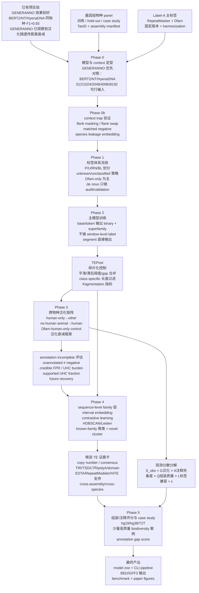

# TE foundation model 研究执行路线图：GENERANNO 整合版

> 版本：执行版 v3  
> 目标：把现有预实验结果、模型/context 选择、统一标签、跨物种泛化、annotation incompleteness、公平 false-positive 评估、family contrastive clustering、候选 TE 验证、组装/注释评分和最终软件产出整合成一条可以直接执行的研究路线。  
> 当前假设：已有 GENERANNO 模型在 TE 注释任务上效果最好或最稳定；BERT2/DNABERT2、Nucleotide Transformer、HyenaDNA 等模型在同物种训练/测试时也能达到约 0.93 F1；GENERANNO 已经做过跨物种泛化初步实验，观察到性能随遗传距离衰减，并且 2048 bp input 的衰减相对较慢。

---

## 一、这篇文章最终应该讲什么故事

这项工作不应该被包装成“我们 fine-tune 了几个 DNA 预训练模型，然后发现某个模型 F1 高”。这种叙事可以作为方法选择依据，但不足以支撑较高水平子刊。更强的主线应该是：

**我们构建了一个跨物种、层级化、annotation-incompleteness-aware 的 TE 注释框架。它使用 DNA foundation model 在 base/token level 输出 TE binary 与 superfamily 注释，在 sequence/interval level 通过 contrastive embedding 与聚类实现 family 层面的已知家族归类与潜在 novel family 发现，并用 no-human→human、human-only Dfam control、泛化衰减框架和未来注释恢复率来回答模型是否学到 TE 通用特征而非数据库偏差。**

这里最核心的不是“模型本身多新”，而是四个方法学贡献：

1. **跨物种泛化能力的严谨评估**：尤其是 no-human animal model 注释 human genome，因为 human TE annotation 相对最完备，能够更接近真实评估模型泛化能力。
2. **不把 unannotated genome 当作 negative**：annotation incomplete 被视为方法学问题，而不是噪声忽略。
3. **TE 注释层级拆分**：base/token level 只做 binary 与 superfamily；family 层面交给 sequence-level embedding、contrastive learning 与 clustering。
4. **从模型概率到可用注释的完整软件路径**：包括 TEPost 后处理、碎片化控制、BED/GFF3 输出、候选证据卡、benchmark 和 model zoo。

这条主线与已有 gene annotation 模型的发展逻辑是一致的。Tiberius 使用 human 作为“arguably best annotated genome”的测试物种，并且控制训练/测试物种的系统发育接近程度；这说明把 human 当作高质量 anchor 来测泛化是一个合理策略。Helixer 和 ANNEVO 则说明，对于跨 clade 的 genome annotation，最终可能需要 clade-specific models，而不是强行追求一个模型在所有 kingdom 都最优。SegmentNT 和 GENATATORs 的经验说明，DNA foundation model 在 genome segmentation 中有价值，但真正影响生物学效用的是 nucleotide/interval-level 输出、context length、postprocessing、跨物种训练策略和 biologically grounded metrics。

---

## 二、总流程图

下面这张图是整个项目的执行骨架。建议后续所有实验记录都按这个 Phase 编号组织，避免模型选择、标签构建、泛化分析、family 聚类和 case study 混在一起。




---

## 三、项目执行原则

### 3.1 模型比较是 Phase 0，不是文章主线

你已经有重要预实验：GENERANNO 在跨物种泛化中出现随遗传距离衰减的模式，且 2048 bp context 的衰减较慢；DNABERT2、Nucleotide Transformer、HyenaDNA 在同物种训练/测试上也能达到约 0.9 以上的F1。这说明**同物种 F1 已经不是瓶颈**。接下来模型比较的重点必须从“谁同物种 F1 更高”转成：

- 哪个模型在 **no-human → human** 中掉分最少；
- 哪个 context size 的 **跨物种衰减斜率最小**；
- 哪个模型的 UHC hit 更少碎片化；
- 哪个 embedding 更按 TE family/superfamily 聚，而不是按 species 聚；
- 哪个模型能在计算成本可控的前提下形成稳定软件。

因此 Phase 0 不应扩展成大规模 model zoo benchmark。建议只保留：

1. **GENERANNO**：主候选，所有主线实验优先用它完成。
2. **DNABERT2**：短 context 或 BERT-like k-mer/tokenization 对照。
3. **Nucleotide Transformer**：SegmentNT 系列工作已经显示 NT + segmentation head 是合理范式，因此它是必要对照。
4. **HyenaDNA**：长序列/efficient long-context 对照，如果训练成本可控则保留，否则放到 supplement。

文章里这个结果最多作为一个主文小节：**Model and context selection for TE segmentation**。它的目的是证明最终选择不是随意的，而不是把文章变成“预训练模型横向比较”。

### 3.2 不做 window-level label

TE 在许多基因组中占比很高，有些物种接近或超过半个 genome。一个 window 里是否含有 TE 没有清晰生物学意义，也会让标签极度依赖窗口边界。你的判断是正确的：

- 模型输入可以是一个 segment/window；
- 但输出必须是 base/token-level 的 probability track；
- label 应该是每个 base/token 的 binary TE 与 superfamily；
- family 不应该在 base/token level 强行做，而应在 interval/sequence level 统一注释。

因此下游所有评估都应该从 probability track 与 TEPost 后的 interval 出发，而不是 window-level classifier。

### 3.3 overlap 不是主要求，edge loss masking 只是可选稳健策略

你目前的模型已经是“单片段输入，直接输出整段序列的逐位标签”，不依赖 overlap。这是好的，因为软件会更简单、推理更快。后续不需要强行把 pipeline 改成 overlap-averaging。

但是有两个场景可以引入 **valid-core loss**：

1. 如果发现片段边缘预测不稳定，则训练时只对中间核心区域计算 loss，两侧只提供上下文；
2. 如果某个长 context 模型在边缘出现系统性误差，可以用 edge-mask 作为增稳策略。

推荐默认策略：

```text
训练主方案：segment 输入，全段输出，全段 loss。
稳健性 ablation：segment 输入，全段输出，但只对中间 70–80% core 计算 loss。
推理主方案：非 overlap tiling，直接拼接输出。
推理可选方案：overlap + averaging，只作为边界稳定性检查，不作为主 pipeline 必需条件。
```

这样既尊重你已有模型设计，又保留了后续应对边缘效应的空间。

---

## 四、Phase 0：模型与 context size 定型

### 4.1 Phase 0 的科学问题

Phase 0 要回答四个问题：

1. GENERANNO 是否仍然是跨物种泛化最优或最稳的 backbone？
2. 2048 bp 的衰减较慢是否可重复？
3. context size 的差异是否主要来自 context-benefit 与 context-trap 的权衡？
4. 选定模型后，是否足以支撑后面 no-human、multi-kingdom、family clustering 和 annotation score？

### 4.2 模型列表与优先级

| 优先级 | 模型 | 目的 | 是否进入主文 |
|---|---|---|---|
| 1 | GENERANNO | 主候选；已有跨物种初步结果；优先完成所有主线 | 是 |
| 2 | BERT2/DNABERT2 | 短 context/k-mer 或 BERT-like tokenization 对照 | 主文或 supplement |
| 3 | Nucleotide Transformer | 与 SegmentNT 范式对齐的必要对照 | 主文或 supplement |
| 4 | HyenaDNA | long-context/efficient architecture 对照 | supplement，若结果特别好再主文 |

如果时间有限，Phase 0 的主文比较只放 GENERANNO、NT、HyenaDNA，BERT2 放 supplement。因为审稿人更容易理解 NT 和 HyenaDNA 的代表性。

### 4.3 context size 设计

你已经观察到 2048 bp 在泛化衰减上更好，因此 Phase 0 应围绕它做确认，而不是盲目探索很多长度。

推荐主比较：

| context size | 使用场景 | 解释 |
|---|---|---|
| 512 bp | 低上下文极限对照 | 看模型是否只靠局部 motif/k-mer |
| 1024 bp | 短中等上下文 | 作为 2048 的近邻对照 |
| 2048 bp | 当前重点 | 已有结果显示跨物种衰减慢，强烈建议主推 |
| 4096 bp | 较长上下文 | 检查是否开始出现 context trap 或物种背景依赖 |
| 8192 bp 或模型最大长度 | 仅对支持模型测试 | 不作为所有模型强制项 |

对于不支持长输入的模型，不强行扩展。比较应以“每个模型的可行最大输入 + 共同输入 2048 bp”为主。也就是说，所有模型必须有 2048 bp 对照，长输入只在模型支持时加入。

### 4.4 Phase 0 数据量

不要在 Phase 0 使用全量训练。目标是快速选择方案。

推荐：

```text
物种：human, mouse, Drosophila, Arabidopsis, rice, S. cerevisiae
每物种每 context：
    50k TE-enriched segments
    30k boundary-centered segments
    20k matched negative/random background segments
总计：约 100k segments/species/context
Phase 0 每个模型每个 context：约 0.6M segments
```

如果计算成本过高，可降为：

```text
human + mouse + Drosophila + Arabidopsis
每物种 50k segments
```

### 4.5 训练/采样方式

不要预先把全基因组完全 window 化并保存所有样本，这会造成存储和重复样本管理负担。推荐维护 genome interval index，然后训练时 on-the-fly sampling：

```text
40% TE-enriched segments：中心落在已知 TE 内部
30% boundary-centered segments：中心距离 TE 边界 ±500 bp
20% hard negative/matched negative：GC/k-mer/repeat-density matched non-TE
10% random background：估计真实 genome background
```

对于 superfamily：

```text
按 superfamily stratified sampling
abundant class capped
rare class oversampling，但不超过 5x
unknown/unclassified 不参与 superfamily loss
```

### 4.6 Phase 0 评估指标

同物种 F1 已经不够。必须加入泛化指标。

| 指标 | 用途 |
|---|---|
| same-species base/token F1 | 确认模型没有失败，但不是主指标 |
| same-species interval F1 / SOV / Jaccard | 检查是否能形成合理 TE 区间 |
| no-human → human F1 / recall | 核心泛化测试 |
| human → mouse/dog/Drosophila/Arabidopsis | 测 human-trained 外推能力 |
| cross-species decay slope | 量化随遗传距离衰减 |
| credible FPR | 在可信 non-TE 区域是否乱报 |
| fragmentation index | 是否产生碎片化注释 |
| species leakage in embedding | 看 embedding 是否按物种而不是 family 聚 |
| runtime / memory | 软件可用性 |

Phase 0 最终选择规则：

```text
首要条件：no-human → human 与 cross-species decay slope 最好或接近最好。
第二条件：fragmentation index 不爆炸。
第三条件：superfamily macro-F1 可接受。
第四条件：推理速度与显存可承受。
```

如果 GENERANNO-2048 在 no-human→human 和多物种 hold-out 中保持最慢衰减，即使它同物种 F1 不是最高，也应作为主模型。

---

## 五、context size 差异如何解释：从假想变成可验证证据

### 5.1 文章中可以使用的解释

可以提出 **context-benefit vs context-trap tradeoff**：

> 较长 context 能提供更完整的 TE 结构、邻近插入背景和 repeat landscape；但过长 context 也可能让模型利用 species-specific GC、repeat density、neighboring repeats、assembly/annotation bias 等背景信号，从而同物种表现更高、跨物种泛化更差。2048 bp 可能处于局部 TE 特征足够、背景偏差尚未过强的折中点。

这不是只放在 Discussion 的猜想，而是要用最小可行实验证明。

### 5.2 必做验证 1：flank masking

对同一 segment 构造：

```text
full:          flank + center + flank
center-only:   NNNNN + center + NNNNN
flank-only:    flank + NNNNN + flank
```

计算：

```text
Flank dependence = p(full) - p(center-only)
Center dependence = p(full) - p(flank-only)
```

如果 4096/8192 模型的 flank dependence 明显高于 2048，并且跨物种掉分更快，就支持 context trap。

### 5.3 必做验证 2：flank swap

把同一个 TE center 的两侧 flank 换成另一个物种、同 GC/同 repeat-density 的 flank：

```text
原始：species A flank + TE center + species A flank
替换：species B matched flank + TE center + species B matched flank
```

如果长 context 模型对 flank swap 更敏感，而 2048 模型更稳定，就说明长 context 更依赖物种背景。

### 5.4 必做验证 3：matched negative

不能用太简单的 negative。需要构建：

```text
GC-matched negative
k-mer-matched negative
repeat-density-matched negative
same-chromosome matched negative
non-TE repeat negative: satellite/simple/tandem/low-complexity separately
```

如果某个 context 在普通 negative 上 precision 很好，但在 matched negative 上掉得明显，说明它可能学到了背景偏差。

### 5.5 必做验证 4：embedding species leakage

对已知 TE intervals 提取 embedding，计算：

```text
NMI(cluster, family)
NMI(cluster, superfamily)
NMI(cluster, species)
silhouette_family
silhouette_species
```

理想结果：

```text
2048 context: family/superfamily signal 强，species signal 弱
4096/8192 context: species signal 上升，若同时泛化衰减加快，则支持 context trap
```

### 5.6 写作方式

文章里不要说“我们证明了模型内部机制就是 context trap”。更稳妥的写法是：

> We observed a context-generalization tradeoff. Perturbation analyses using flank masking, flank swapping and matched negatives showed that longer-context models were more sensitive to species-specific flanking backgrounds, supporting a context-trap explanation.

这样既有解释力，又不过度承诺。

---

## 六、Phase 1：标签来源与 harmonization

### 6.1 主标签选择

建议主标签使用：

```text
Label-A = self-run RepeatMasker + Dfam，固定软件版本、Dfam版本、参数和物种名。
```

不建议把 UCSC/Ensembl/NCBI 已有 repeat tracks 作为主训练标签。原因是不同物种、不同来源、不同年份的 repeat annotation 版本和策略不一致，会直接引入 label-source bias。UCSC tracks 可以作为 human/hg19/hg38/T2T 的对照和 future recovery 分析材料，但不作为跨物种主标签。

也不建议所有物种都用 de novo library + Dfam 作为主标签。de novo library 能提高 recall，但不同物种 de novo 结果质量不均，会把 pipeline-specific bias 引入训练。更稳的策略是：

| 标签层级 | 来源 | 用途 | 是否所有物种 |
|---|---|---|---|
| Label-A | RepeatMasker + Dfam | 主训练、主评估、主泛化矩阵 | 是 |
| Label-B | RepeatModeler2/EDTA/HiTE + RepeatMasker | label-source sensitivity、baseline、候选验证 | 只做 6–8 个代表物种 |
| Label-C | structure/copy/consensus/domain/cross-assembly evidence | novel family 证据卡 | 只做 UHC clusters |

### 6.2 为什么 Dfam-only 作为主标签足够支撑文章

从发表角度，主问题是“模型是否能在统一标签体系下学习跨物种 TE 特征”。如果一开始就给每个物种跑不同质量的 de novo library，审稿人会质疑：模型学到的是 TE 特征，还是 de novo pipeline 的物种特异性误差。

因此：

```text
主训练：RepeatMasker + Dfam，统一可复现。
补充验证：de novo tools 只用于少数物种和 high-confidence candidates。
```

收益最大的是 label-source sensitivity：只要在 6–8 个物种上证明 Dfam-only 与 Dfam+de novo 的主结论方向一致，就足以应对审稿人的标签来源质疑。

### 6.3 RepeatMasker + Dfam 执行建议

每个物种建立固定目录：

```text
project/
  data/genomes/{species}/genome.fa
  data/annotations/repeatmasker_dfam/{species}/
  manifests/genome_manifest.tsv
  manifests/repeatmasker_manifest.tsv
  manifests/label_harmonization_manifest.tsv
```

推荐命令模板：

```bash
RepeatMasker \
  -pa 32 \
  -xsmall \
  -gff \
  -a \
  -dir data/annotations/repeatmasker_dfam/${species} \
  -species "${repeatmasker_species_name}" \
  data/genomes/${species}/genome.fa
```

注意：

- 不要默认使用 `-nolow`，因为 simple/low-complexity 信息对后续 blacklist 和 fair FP 评估有价值；
- simple repeat、low complexity、satellite 后续单独标记，不作为普通 negative；
- 每次运行记录 RepeatMasker version、Dfam version、search engine、species 参数、library path、MD5。

### 6.4 human-only Dfam control

这是你已经做过并且很有价值的实验，必须纳入主线。

对每个 target species 跑两套 RepeatMasker：

```bash
# target/clade-specific baseline
RepeatMasker -species "${target_species}" target.fa

# human-only Dfam baseline
RepeatMasker -species "Homo sapiens" target.fa
```

比较：

```text
human-finetuned model → target species
Dfam-human-only RepeatMasker → target species
target/clade Dfam RepeatMasker → target species
```

逻辑：如果模型只是复制 human Dfam/database bias，它在其他物种上的结果应接近 human-only Dfam baseline；如果模型显著优于 human-only Dfam baseline，并且 UHC hits 被 de novo/结构证据支持，则说明模型学习了更通用的 TE sequence features。

### 6.5 label harmonization 表结构

每条 RepeatMasker/de novo 注释都转成统一表：

```text
species
kingdom
assembly_accession
assembly_name
chrom
start
end
strand
source
source_version
software
software_version
database
database_version
repeatmasker_species_parameter
raw_repeat_name
raw_class_family
raw_score
raw_divergence
raw_deletion
raw_insertion
harmonized_binary
harmonized_class
harmonized_superfamily
harmonized_family
label_confidence
include_binary_loss
include_superfamily_loss
include_family_eval
exclude_reason
md5_genome
md5_library
run_id
```

### 6.6 unknown/unclassified 处理规则

| 原始情况 | binary loss | superfamily loss | family/embedding | 说明 |
|---|---:|---:|---:|---|
| LINE/SINE/LTR/DNA/RC/Helitron 等明确 TE | 参与 positive | 参与 | 可进入 known family | 主正样本 |
| TE/Unknown、Interspersed/Unknown | 参与 positive 或低权重 positive | 不参与 | 可作为 unknown TE candidate | 不应当 negative |
| Unknown repeat，无明确 TE class | 不参与 | 不参与 | 作为 U 区域 | 避免误导 |
| Simple_repeat/Low_complexity/Satellite/Tandem | 不作为普通 negative | 不参与 | 进入 blacklist 或 non-TE repeat class | 用于 blacklist hit rate |
| rRNA/tRNA/snRNA 等小 RNA | 通常排除 | 不参与 | 不参与 | 避免与 TE 混淆 |

### 6.7 overlap 与 nested TE 的 label priority

base/token-level 不需要强行解决所有 nested TE 的 family 冲突。推荐：

```text
binary：只要被任一可信 TE 覆盖，即 positive。
superfamily：如果多个不同 superfamily 同时覆盖，则该位置 mask superfamily loss。
family：不在 base/token level 训练；只在 sequence-level interval 上处理。
```

优先级只用于同类冲突时选择 representative annotation：

```text
curated Dfam > uncurated Dfam > de novo structural > de novo homology > simple/tandem/low-complexity
```

不要过早写复杂 nested TE dissection，因为会占用大量时间，且未必改变主结论。

---

## 七、物种选择：精确可执行 panel

### 7.1 总原则

物种不要扩展到 100 个。对这个项目来说，100 个物种不是加分项，反而可能引入大量低质量注释和计算负担。更好的设计是：

```text
训练物种：每个 kingdom 选择进化树上有代表性、注释相对好的节点。
hold-out 物种：不进入训练，用于泛化衰减和 annotation completeness 评估。
case study 物种：少量深入验证，不追求数量。
```

### 7.2 Phase 0 pilot 物种

| 物种 | TaxID | 用途 |
|---|---:|---|
| Homo sapiens | 9606 | human anchor；同物种与 human-only source |
| Mus musculus | 10090 | mammal cross-species |
| Drosophila melanogaster | 7227 | invertebrate model |
| Arabidopsis thaliana | 3702 | plant model |
| Oryza sativa | 4530 | monocot plant |
| Saccharomyces cerevisiae | 4932 | fungi extreme/compact genome |

Phase 0 如果资源紧张，先用 human、mouse、Drosophila、Arabidopsis 四个物种。

### 7.3 Animal panel

| 角色 | 物种 | TaxID | 用途 |
|---|---|---:|---|
| gold anchor hold-out | Homo sapiens | 9606 | no-human animal → human；hg19/hg38/T2T score |
| training no-human | Mus musculus | 10090 | rodent mammal training |
| training no-human | Rattus norvegicus | 10116 | rodent mammal training/validation |
| training no-human | Canis lupus familiaris | 9615 | carnivore mammal training |
| training or hold-out | Bos taurus | 9913 | ruminant；同一实验中训练/测试二选一 |
| hold-out | Sus scrofa | 9823 | mammal hold-out |
| hold-out | Equus caballus | 9796 | mammal hold-out |
| optional hold-out | Macaca mulatta | 9544 | close-to-human positive control；不进入 no-human training |
| training no-human | Gallus gallus | 9031 | bird branch |
| training no-human | Danio rerio | 7955 | fish branch |
| hold-out | Xenopus tropicalis | 8364 | amphibian branch |
| training no-human | Drosophila melanogaster | 7227 | insect model |
| hold-out | Tribolium castaneum | 7070 | beetle hold-out |
| hold-out | Apis mellifera | 7460 | hymenopteran hold-out |
| training no-human | Caenorhabditis elegans | 6239 | nematode branch |

注意 Bos taurus 不要在同一个 transfer test 中同时作为训练和 hold-out。可以设计两个版本：

```text
Animal-training-v1：mouse, rat, dog, cow, chicken, zebrafish, Drosophila, C. elegans
Animal-holdout-v1：human, pig, horse, Xenopus, Apis, Tribolium

Animal-training-v2：mouse, rat, dog, pig, chicken, zebrafish, Drosophila, C. elegans
Animal-holdout-v2：human, cow, horse, Xenopus, Apis, Tribolium
```

这样可以避免单个 mammal branch 选择对结论的影响。

### 7.4 Plant panel

| 角色 | 物种 | TaxID | 用途 |
|---|---|---:|---|
| training | Arabidopsis thaliana | 3702 | best-studied plant |
| training | Oryza sativa | 4530 | monocot model |
| training | Zea mays | 4577 | repeat-rich monocot |
| training | Glycine max | 3847 | dicot crop |
| training or hold-out | Sorghum bicolor | 4558 | grass branch |
| hold-out | Setaria viridis | 4556 | monocot hold-out |
| hold-out | Solanum lycopersicum | 4081 | asterid/dicot hold-out |
| hold-out | Vitis vinifera | 29760 | rosid/dicot hold-out |
| optional case | Brassica napus | 3708 | polyploid/repeat-rich；复杂但有价值 |

植物部分可以先做 Arabidopsis、rice、maize 三个训练物种，Solanum/Setaria/Vitis 三个 hold-out；如果 plant model 结果有价值，再加入 Glycine/Sorghum/Brassica。

### 7.5 Fungi panel

| 角色 | 物种 | TaxID | 用途 |
|---|---|---:|---|
| training | Saccharomyces cerevisiae | 4932 | budding yeast；compact genome |
| training | Schizosaccharomyces pombe | 4896 | fission yeast |
| training | Neurospora crassa | 5141 | filamentous fungus |
| training or validation | Aspergillus nidulans | 162425 | model filamentous fungus |
| training or hold-out | Ustilago maydis | 5270 | basidiomycete branch |
| hold-out | Fusarium graminearum | 5518 | plant pathogen hold-out |
| hold-out | Cryptococcus neoformans | 5207 | basidiomycete hold-out |

Fungi 的 TE 注释和 TE 含量可能不如 animal/plant 主线强，建议作为第三优先级。第一版文章如果 fungi 结果不稳，可以只作为 cross-kingdom generalization 与 optional model，而不是强行 release fungi production model。

### 7.6 物种下载和 manifest

每个物种记录：

```text
species
taxid
kingdom
role
assembly_source
assembly_accession
assembly_name
assembly_level
refseq_category
genome_size
N50
BUSCO if available
RepeatMasker version
Dfam version
label_run_id
```

下载建议使用 NCBI Datasets 或 Ensembl/Ensembl Plants/Fungi。优先级：

```text
RefSeq reference genome > RefSeq representative genome > Ensembl canonical assembly > community gold assembly
```

human 单独保留：

```text
hg19/GRCh37
hg38/GRCh38
T2T-CHM13
```

用于 annotation/assembly score，不全部进入训练。

---

## 八、多物种训练比例与数据量

### 8.1 不按 genome size 直接加权

不能按 genome size 或 raw TE bp 直接采样，否则 maize、human 等大 genome 会支配训练。也不能每个物种完全等权，因为小 genome/低 TE 物种会被过度放大。

推荐：

```text
species_weight_i ∝ min(sqrt(positive_TE_bp_i), cap)
```

并加入 clade-level cap：

```text
一个 clade 在一个 batch 中最多占 50%。
单个物种在混合模型中最多占 25%，除非它是明确 anchor。
```

### 8.2 human-centered 训练比例

用于比较 human-only 与少量补充物种是否改善泛化。

| 模型 | human | auxiliary animals | 用途 |
|---|---:|---:|---|
| H100 | 100% | 0% | human-only source model |
| H90+A10 | 90% | 10% | 轻量 supplement |
| H80+A20 | 80% | 20% | 推荐主比例 |
| H60+A40 | 60% | 40% | 检查过多补充是否损害 human performance |

如果 auxiliary 有 8 个物种，A20 不是每个固定 2.5%，而是：

```text
A20 内部按 capped sqrt positive TE bp 分配；
同时每个 auxiliary 至少 1%，最多 5%。
```

### 8.3 no-human animal model

no-human model 不是为了生产最强 human 注释器，而是为了评估真实泛化。

推荐训练：

```text
mouse, rat, dog, cow/pig二选一, chicken, zebrafish, Drosophila, C. elegans
human excluded
close primates excluded
```

训练比例：

```text
mammals: 45%
non-mammal vertebrates: 25%
invertebrates: 30%
```

如果使用 8 个物种：

```text
mouse 10%
rat 8%
dog 9%
cow/pig 10%
chicken 12%
zebrafish 13%
Drosophila 19%
C. elegans 19%
```

这个比例看似 invertebrate 较高，是为了避免模型只成为 mammal model；实际可根据 positive_TE_bp capped 调整。

### 8.4 kingdom-specific models

最终是否 release kingdom-specific models 由结果决定。推荐先训练：

```text
Animal model
Plant model
Fungi model（低优先）
Universal model（只在前三者结果稳定后做）
```

植物模型比例：

```text
Arabidopsis 20%
Oryza 25%
Zea mays 25%
Glycine 15%
Sorghum 15%
```

Fungi 模型比例：

```text
S. cerevisiae 25%
S. pombe 20%
N. crassa 25%
A. nidulans 15%
U. maydis 15%
```

Universal model 初版：

```text
animals 45%
plants 40%
fungi 15%
```

如果 universal 明显比 kingdom-specific 差，则 release kingdom-specific models；如果差距很小，则 release universal + optional adapters。

### 8.5 主训练数据量

以 2048 bp 为默认 context 估算：

| 阶段 | 每模型样本量 | 目标 |
|---|---:|---|
| Phase 0 pilot | 0.5–1M segments | 模型/context 定型 |
| Phase 2 main binary/superfamily | 5–10M segments | 主模型训练 |
| Phase 3 transfer matrix | 每个 source model 2–5M segments | 比较不同训练组成 |
| Phase 4 contrastive family | 0.5–2M intervals/pairs | family embedding |

如果使用 4096 bp，样本量可减半，保持总 bp budget 接近。

推荐以 **observed bp budget** 管理训练，而不是单纯 segment 数：

```text
Phase 0：1–3 Gb observed bp / model-context
Phase 2：10–30 Gb observed bp / model
Phase 3：5–15 Gb observed bp / source model
```

---

## 九、Phase 2：主模型结构与输出

### 9.1 输出层级

主模型输出：

```text
base/token-level:
    p(TE)
    p(superfamily | TE)
    optional p(boundary)

sequence/interval-level:
    family assignment
    known family retrieval
    novel family clustering
```

不做 token-level family。这是合理且必要的，因为 family 层面经常依赖整段 TE copy、截断模式、consensus 相似性、结构特征和 copy-level 信息。把 family 压到每个 token 上会增加标签噪声，也会让 rare family 极度不平衡。

### 9.2 superfamily label set

先不要定义太细。建议初版：

```text
Background
LINE/L1
LINE/L2
LINE/RTE or LINE/other
SINE/Alu or SINE/other
LTR/ERV1
LTR/ERVK
LTR/ERVL
LTR/Gypsy
LTR/Copia
DNA/hAT
DNA/TcMar
DNA/MULE
DNA/PiggyBac
DNA/PIF-Harbinger
RC/Helitron
Other_TE
Unknown_TE_binary_only
```

具体类别最终根据 Label-A 统计确定：

```text
如果某 superfamily positive bp < 全部 TE bp 的 0.5%，先合并为 Other_TE。
如果某 superfamily 只在一个物种出现且样本少，放到 rare/Other，避免模型学物种标签。
```

### 9.3 loss 设计

```text
L_total = L_binary + λ_sf L_superfamily + λ_boundary L_boundary + λ_smooth L_smooth_optional
```

其中：

```text
binary loss：P vs sampled RN/hard negatives；U 不作为 negative。
superfamily loss：只在明确 superfamily 的 TE positions 上计算。
boundary loss：只在 Label-A 高置信边界附近计算，可选。
smooth loss：弱约束，防止概率剧烈抖动；不要过强，以免抹掉真实短 TE fragments。
```

如果使用 focal loss 或 class-balanced CE：

```text
binary：focal 或 weighted BCE
superfamily：class-balanced CE
rare class：oversampling + class weights，避免只靠 loss weight
```

### 9.4 TEPost 后处理

TEPost 是论文和软件的重要组成部分。它解决两个问题：

1. 逐位概率怎么转成 BED/GFF3 interval；
2. 如何避免 PU 或普通 threshold 造成碎片化。

推荐流程：

```text
1. input: p(TE), p(superfamily), optional p(boundary)
2. optional reverse-complement test-time averaging
3. probability smoothing，window 根据 context 和 TE class 设置
4. hysteresis threshold:
      τ_high 启动 segment
      τ_low 延伸 segment
5. gap merge:
      同一 superfamily 且 gap < g bp 合并
6. minimum length filtering:
      class-specific min length
7. boundary refinement:
      根据 probability gradient / boundary head / TSD/TIR/LTR motif 调整
8. conflict resolution:
      nested 或 overlapping segment 先保留，评估时分层处理
9. output:
      BED/GFF3 + score + superfamily + confidence + evidence flags
```

主评估必须报告：

```text
segments_per_Mb
median_segment_length
short_fragment_fraction
split_ratio
merge_ratio
region-level Jaccard/SOV
```

---

## 十、Phase 3：跨物种泛化与泛化衰减框架

### 10.1 核心实验矩阵

| 实验 | 训练 | 测试 | 目的 |
|---|---|---|---|
| H100 → animal/plant/fungi | human only | all hold-outs | human-trained 外推能力 |
| no-human animal → human | non-human animals | human | 真实泛化 anchor |
| animal → plants/fungi | animal model | plant/fungi hold-outs | cross-kingdom 极限 |
| plant → animals/fungi | plant model | animal/fungi hold-outs | cross-kingdom 对照 |
| kingdom-specific → same kingdom hold-outs | animal/plant/fungi | same kingdom hold-outs | production model 评估 |
| universal → all hold-outs | mixed kingdoms | all | 判断是否 release universal |
| Dfam-human-only → other species | RepeatMasker -species human | all hold-outs | 数据库偏差 control |
| target/clade Dfam → target | RepeatMasker target species | target | 常规数据库 baseline |

### 10.2 no-human → human 为什么是主实验

human genome 的 TE annotation 相对最完备。如果用 human-trained model 去测其他物种，observed false positive 会受到其他物种 annotation incompleteness 的强烈影响。相反：

```text
train: non-human animals
hold-out target: human
```

因为 target annotation 更完备，模型在 human 上的 observed score 更接近真实泛化能力。这是你手稿中最重要的创新点之一，必须放到主文，而不是 supplement。

### 10.3 与相似遗传距离物种比较

为了判断其他物种注释完备度，可以比较：

```text
no-human animal → human score
no-human animal → pig/cow/horse score
no-human animal → chicken/zebrafish score
```

如果某个 hold-out 与训练集的最小遗传距离与 human 类似，但 observed score 明显低于 human，可能原因包括：

```text
annotation incomplete
TE landscape 特别不同
assembly repeat collapse
database/clade label mismatch
```

不能立即断言“注释不完整”，但可以把它作为 annotation gap candidate，并通过 UHC evidence 和 de novo support 验证。

### 10.4 泛化衰减公式

不要过度承诺一个精确公式。建议作为 descriptive framework：

```text
S_obs(M, T) = G_M(d, K, C, F) × A_T × Q_T × L_T + ε
```

其中：

```text
S_obs: 模型 M 在 target species T 上相对于当前 annotation 的观测分数
G_M: 模型真实泛化能力
    d = source-target phylogenetic distance
    K = kingdom/clade shift
    C = context size/backbone
    F = training family/superfamily coverage
A_T: target species annotation completeness
Q_T: assembly quality/repeat recovery quality
L_T: label-source compatibility
ε: 未建模误差
```

可拟合的 logit 形式：

```text
logit(S_obs) = β0
             + β1 log(1 + d_min_to_training)
             + β2 I_cross_kingdom
             + β3 context_size
             + β4 training_superfamily_coverage
             + β5 assembly_N50_or_QV
             + β6 current_repeat_content
             + β7 label_source_indicator
             + u_species
             + ε
```

文章中应该强调：

> 该公式不是为了精确估计每个物种的真实 TE 注释完备度，而是为了分解 observed performance 的可能来源，识别低于预期的 species/regions，并指导 annotation gap discovery。

### 10.5 统计检验

模型比较可以使用 chromosome/block bootstrap：

```text
同一物种内，按 chromosome 或 1 Mb blocks 进行 paired bootstrap。
```

跨物种泛化不能把 chromosome 当独立 species。应使用：

```text
species-level bootstrap
或 mixed model:
metric ~ model + context + phylo_distance + (1 | species) + (1 | species:chromosome)
```

p-value 以 species-level 为主，chromosome/block 只估计 within-species variance。

---

## 十一、annotation incomplete 下如何公平评估 false positive

### 11.1 基本原则

```text
unannotated ≠ negative
```

因此不能用 naive FP：

```text
predicted TE but not in current annotation = false positive
```

这在 TE 任务中会严重惩罚模型，因为 genome 里必然有漏注释、低质量注释、unknown TE、重复塌缩区域和数据库未覆盖 family。

### 11.2 genome 区域划分

| 区域 | 定义 | 用途 |
|---|---|---|
| P | 当前高置信 TE annotation | recall/superfamily eval |
| U | 未注释区域 | 不直接当 negative |
| RN | reliable negative | credible FPR |
| UR | unannotated repeat-like region | UHC discovery |
| BL | blacklist: gap/simple/tandem/satellite/low-complexity | blacklist hit rate |
| UHC | unannotated high-confidence model hit | discovery/annotation gap |

RN 的构建要保守：

```text
不被 RepeatMasker/Dfam/de novo/simple/satellite/tandem/low-complexity 覆盖
距离已知 TE 边界 > 1 kb
非 assembly gap
GC/k-mer/repeat-density 可匹配
最好在多个 annotation source 中都保持 non-repeat
```

### 11.3 主评估指标

| 指标 | 定义 | 解释 |
|---|---|---|
| annotated recall | P 中被模型恢复的比例 | 模型能否找回已知 TE |
| superfamily macro-F1 | 已知 superfamily 上的分类能力 | 防止常见类支配 |
| credible FPR | RN 中预测为 TE 的比例 | 更公平的 precision proxy |
| blacklist hit rate | BL 中模型高分比例 | 检查是否把 simple/satellite 当 TE |
| UHC burden | U 中高置信 TE hit 的 bp/Mb | 未注释候选负担 |
| supported UHC fraction | UHC 中有独立证据支持的比例 | 衡量“FP 中可能 TP”的比例 |
| future recovery rate | 旧 annotation 中 UHC 后来被新 annotation 覆盖的比例 | 证明 annotation incomplete |
| precision@K reviewed | 人工/半自动 evidence card 审核前 K 个 cluster | novel discovery 可信度 |

### 11.4 不做 PU-learning 是否影响发表？

不建议把 PU-learning 作为主线。你已经观察到 PU-learning 容易把 U 区域大量预测为 positive，导致高度碎片化。这会把项目拖入另一个复杂问题：如何估计 positive prior、如何防止 U 被无限扩张、如何证明新增 positive 不是 false positive。

不做 PU-learning 不会影响文章，前提是我们把 annotation incompleteness 变成评估和发现框架：

```text
fair FP evaluation
UHC evidence cards
future annotation recovery
human/no-human anchor calibration
```

这些比一个效果不稳定的 PU module 更有说服力。

### 11.5 如果保留 PU-learning，只作为 supplement

保守 PU 方案：

```text
L = supervised_loss(P, RN)
  + λ_pu nnPU_loss(P, U, prior=π)
  + λ_cov coverage_prior_penalty
  + λ_tv total_variation_loss
  + λ_frag fragmentation_penalty
```

必要约束：

```text
predicted_TE_fraction 不得远高于 RepeatMasker + de novo + literature repeat content 的合理范围；
short_fragment_fraction 不得超过 supervised model 的 1.5x；
UHC supported fraction 必须提高，否则 PU 不进入主文。
```

如果 PU 结果继续碎片化，文中可写为：

> We evaluated PU-style training but found that unconstrained unlabeled positives caused fragmented over-annotation; therefore, we treated annotation incompleteness as an evaluation and discovery problem rather than as a direct training objective.

---

## 十二、Phase 4：sequence-level family annotation 与 novel family discovery

### 12.1 逻辑

base/token-level 输出 superfamily 就足够。family 需要整段序列。

流程：

```text
model probability track
→ TEPost intervals
→ extract interval sequence + embedding
→ contrastive learning
→ known family retrieval / clustering
→ UHC novel cluster discovery
```

### 12.2 embedding 来源

对每个 TEPost interval：

```text
encoder hidden states
segmentation head penultimate layer
superfamily head pooled representation
```

pooling：

```text
mean pooling
max pooling
attention pooling
boundary-aware pooling
multi-crop pooling
reverse-complement averaged pooling
```

推荐初版：

```text
mean pooling + attention pooling 两种并行；
最终使用 validation family retrieval top-k 更好的方案。
```

### 12.3 contrastive learning 设计

positive pairs：

```text
同一 interval 的 reverse complement
同一 interval 的 random crop / boundary jitter
同一 known family 的不同 copies
同一 consensus-derived fragments
同一 superfamily 但不同 family：弱 positive 或 hierarchical positive
```

negative pairs：

```text
不同 family
不同 superfamily
hard negatives: GC/k-mer matched non-TE repeat
satellite/tandem/simple repeat
不同 species 但相似 background 的 non-TE intervals
```

loss：

```text
L_family = L_instance_contrastive
         + α L_supervised_contrastive_known_family
         + β L_superfamily_hierarchical
         + γ L_species_debias_optional
```

关键是避免 embedding 按 species 聚类。可以加入 batch 设计：

```text
每个 batch 混合多个 species、多个 family；
同 family/cross-species copy 优先成 positive；
species-balanced sampling。
```

### 12.4 聚类方法

不预设 cluster 数，推荐：

```text
HDBSCAN
Leiden on kNN graph
hierarchical clustering as sensitivity analysis
```

known family 评估：

```text
ARI
NMI
homogeneity
completeness
silhouette_family
silhouette_species
nearest-neighbor family retrieval top-1/top-5
species-mixing score
```

关键图：

```text
UMAP/t-SNE of known TE intervals colored by family/superfamily/species
contrastive-before vs contrastive-after
UHC clusters projected with known families
```

### 12.5 novel family cluster 判定

不要只靠模型高分。定义：

```text
UHC = unannotated high-confidence hit
Novel cluster = UHC intervals forming stable embedding cluster and passing evidence tier ≥ 2
```

Evidence tiers：

| Tier | 证据 | 可写法 |
|---|---|---|
| 0 | 只有模型高分 | candidate only |
| 1 | 多 copy + embedding cluster + blacklist 过滤通过 | repeat-like candidate |
| 2 | consensus 可构建，边界较一致，不是 tandem/simple/satellite | credible repeat family |
| 3 | TIR/TSD/LTR/polyA/ORF/domain 或 de novo tool 支持 | credible TE family candidate |
| 4 | cross-assembly/近缘物种/pangenome insertion polymorphism 支持 | high-confidence novel or underannotated TE family |

---

## 十三、high-confidence candidate 如何判定

UHC interval 必须满足：

```text
p(TE) ≥ τ_high
superfamily confidence ≥ τ_sf
segment length within class-specific reasonable range
not gap/simple/tandem/satellite/low-complexity blacklist
prediction stable under RC augmentation
prediction stable under flank perturbation
not an isolated single short fragment
belongs to stable embedding cluster
```

Cluster-level evidence：

```text
copy number ≥ 5 或根据 genome size/TE class 调整
consensus length 合理
copy-to-consensus alignment 清晰
boundaries show enrichment of TSD/TIR/LTR/polyA signals if class relevant
protein domain search detects RT/integrase/transposase/RNaseH/gag/pol if expected
de novo tools recover overlapping family or partial library hit
present in multiple assemblies or related species
not overlapping gene exons in suspicious way unless known TE-derived gene context
```

每个 high-confidence cluster 输出 evidence card：

```text
cluster_id
species
predicted_superfamily
copy_number
median_length
consensus_length
mean_model_score
known_annotation_overlap
blacklist_overlap_fraction
RepeatModeler/EDTA/HiTE support
structure_support
protein_domain_support
cross_species_support
final_tier
```

---

## 十四、biodiversity case study 怎么做

不要扫 100 个物种。建议做少量高质量 case：

| Case | 物种 | 目的 |
|---|---|---|
| Case 1 | human hg19/hg38/T2T | future recovery + assembly score |
| Case 2 | Zea mays 或 Brassica napus | repeat-rich plant 中 UHC cluster 验证 |
| Case 3 | Drosophila/Tribolium/Apis | invertebrate transfer 与 novel/underannotated family |
| Case 4 | Fusarium 或 Cryptococcus | fungi optional case |

每个 case 展示：

```text
1. genome browser track:
   model p(TE), superfamily, RepeatMasker/Dfam, de novo, genes, gaps/blacklist
2. copy alignment:
   copies aligned to consensus, boundary consistency
3. structural evidence:
   TSD/TIR/LTR/polyA/domain
4. embedding evidence:
   cluster separated from known families but near predicted superfamily
5. cross-assembly/cross-species evidence:
   same cluster in related assembly/species
6. false-positive exclusion:
   not tandem/simple/satellite/segmental duplication/gap artifact
```

---

## 十五、Phase 5：组装/注释评分

### 15.1 什么时候开始做组装评分

不能太早。组装评分必须放在模型/context 定型、标签体系冻结、fair FP 框架和 TEPost 稳定之后。建议顺序：

```text
Phase 0: 只能做 quick QC，不对外解释成 assembly score。
Phase 3: 有 no-human→human 和 fair FP 后，开始建立 score framework。
Phase 5: 正式做 hg19/hg38/T2T 与 case species assembly/annotation score。
```

### 15.2 human assembly score

human 是最适合做 assembly/annotation score 的系统：

```text
hg19/GRCh37
hg38/GRCh38
T2T-CHM13
```

可比较：

```text
known TE recall
UHC burden
UHC future recovery
segment fragmentation
repeat-rich region recovery
pericentromeric/subtelomeric behavior
```

如果模型在 T2T 中恢复更多 repeat-rich/previously unresolved regions，并且这些高分 hits 有 T2T/updated RepeatMasker/de novo support，这会是很强的结果。

### 15.3 annotation gap score

定义：

```text
AnnotationGapScore = normalized_UHC_burden × supported_UHC_fraction × calibration_factor
```

其中：

```text
normalized_UHC_burden = UHC bp per Mb after blacklist filtering
supported_UHC_fraction = UHC clusters with Tier ≥ 2 evidence
calibration_factor = no-human→human anchor and credible FPR calibration
```

不建议直接说“这个物种注释完整度是 70%”。更稳的写法：

> The model identifies an excess burden of high-confidence, independently supported TE-like intervals not present in the current annotation, suggesting potential annotation incompleteness.

### 15.4 组装质量与注释完备度分开

一个物种 score 低可能来自：

```text
模型泛化差
注释不完整
assembly repeat collapse
gap/low-quality regions
label-source mismatch
TE landscape 特殊
```

因此 score 要拆分：

```text
ModelFitScore：已知 TE 上的 recall/superfamily accuracy
CredibleFPRScore：可信 negative 上误报
AnnotationGapScore：UHC burden + support
AssemblyRepeatRecoveryScore：不同 assembly/版本中 repeat-rich 区域恢复
FragmentationScore：预测是否碎片化
```

---

## 十六、最终软件/pipeline 设计

### 16.1 命令行输入输出

输入：

```text
genome.fa
model_name
optional species/kingdom tag
optional RepeatMasker annotation for calibration
```

输出：

```text
predictions.bed
predictions.gff3
probability_track.bigWig or bedGraph
superfamily_track.bed
candidate_UHC.bed
evidence_cards.tsv
run_manifest.json
```

### 16.2 模型 zoo

根据结果决定 release：

```text
TE-GENERANNO-human
TE-GENERANNO-animal-noHuman-benchmark
TE-GENERANNO-animal
TE-GENERANNO-plant
TE-GENERANNO-fungi optional
TE-GENERANNO-universal optional
```

其中：

```text
animal-noHuman 是 benchmark/control model，不是 production model。
animal/plant/fungi 是 production models。
universal 只有在表现接近 kingdom-specific 时 release。
```

### 16.3 运行模式

```text
mode predict:
    genome.fa → model probability → TEPost → BED/GFF3

mode benchmark:
    genome.fa + reference repeat annotation → metrics

mode discover:
    predictions + known annotations + blacklist → UHC clusters + evidence cards

mode embed:
    TE intervals → embeddings → family retrieval/clustering

mode score:
    predictions + annotations + assembly metadata → annotation/assembly scores
```

---

## 十七、论文结果组织建议

### Result 1：GENERANNO 与 context 选择

展示：

```text
模型/context same-species F1
no-human→human score
cross-species decay slope
fragmentation index
context perturbation evidence
```

主结论：

> GENERANNO-2048 在同物种性能接近最优的同时，跨物种衰减最慢，并且对物种特异性 flanking background 依赖较低，因此作为主模型。

### Result 2：统一标签与 fair benchmark

展示：

```text
Label-A pipeline
unknown/unclassified policy
credible negative construction
Dfam-only vs Dfam+de novo sensitivity in 6–8 species
```

主结论：

> 统一 self-run RepeatMasker + Dfam 标签提供了可复现 benchmark；de novo label sensitivity 不改变主结论。

### Result 3：跨物种泛化与 no-human→human

展示：

```text
transfer matrix
no-human animal → human
human-only → other species
Dfam-human-only baseline
phylogenetic decay plot
```

主结论：

> 模型在没有 human training labels 的情况下仍能恢复 human TE annotation；其跨物种性能不能被 human-only Dfam database bias 解释。

### Result 4：annotation incomplete-aware FP evaluation

展示：

```text
credible FPR
UHC burden
supported UHC fraction
future recovery in hg19/hg38/T2T or old/new Dfam
```

主结论：

> 一部分 naive false positives 是当前 annotation 中缺失的 TE-like intervals。

### Result 5：superfamily segmentation 与 TEPost

展示：

```text
binary/superfamily performance
TEPost before/after fragmentation index
interval-level Jaccard/SOV
BED/GFF3 examples
```

主结论：

> 模型不是只会 base-wise classification，而能输出结构合理的 TE intervals。

### Result 6：contrastive family embedding 与 novel cluster

展示：

```text
known family clustering
species leakage reduction
UHC novel clusters
evidence cards
```

主结论：

> sequence-level embedding 能把 known family 聚在一起，并从 unannotated high-confidence hits 中分离出潜在 novel/underannotated family。

### Result 7：case studies 与软件

展示：

```text
human assembly/version case
plant or invertebrate novel family case
runtime/software output
```

主结论：

> 该框架可以作为可用 TE annotation software，并帮助改进未来 genome annotation。

---

## 十八、执行时间表

### Week 1–2：冻结基础设置

交付：

```text
genome_manifest.tsv
species_panel.tsv
RepeatMasker/Dfam environment
label_harmonization rules
Phase 0 sampling scripts
```

### Week 3–5：Phase 0 模型/context 定型

交付：

```text
GENERANNO/BERT2/NT/HyenaDNA × context size results
same-species + transfer mini-matrix
context perturbation pilot
选定主模型与默认 context
```

Go/No-Go：

```text
如果 GENERANNO-2048 仍是泛化最稳，则锁定。
如果 NT/HyenaDNA 明显更稳，则改主模型，但 GENERANNO 作为强对照。
```

### Week 6–8：Label-A 全物种与 Label-B audit

交付：

```text
RepeatMasker+Dfam annotations
harmonized BED/GFF3
P/U/RN/BL masks
6–8 species de novo audit
```

### Week 9–12：主模型训练

交付：

```text
binary + superfamily model
TEPost v1
fragmentation metrics
same-kingdom holdout results
```

### Week 13–16：泛化矩阵与 no-human→human

交付：

```text
human-only → other
no-human animal → human
Dfam-human-only baseline
phylogenetic decay framework
statistics/bootstrap
```

### Week 17–20：fair FP 与 future recovery

交付：

```text
credible FPR
UHC burden
supported UHC fraction
hg19/hg38/T2T recovery
```

### Week 21–25：family embedding 与 novel candidates

交付：

```text
contrastive family model
known family cluster metrics
UHC clusters
candidate evidence cards
```

### Week 26–30：case studies 与软件整理

交付：

```text
2–4 high-quality case studies
CLI pipeline
model zoo
paper figures v1
```

---

## 十九、最小可发表版本与增强版本

### 最小可发表版本

必须完成：

```text
1. GENERANNO + 至少两个对照模型 + 2048/4096 context 比较
2. self-run RepeatMasker + Dfam Label-A
3. base/token binary + superfamily 输出
4. no-human animal → human 主实验
5. human-only model + Dfam-human-only baseline
6. fair FP framework: credible FPR + UHC burden
7. TEPost 碎片化控制
8. known family embedding clustering
9. 1–2 个 UHC cluster evidence cards
10. CLI 输出 BED/GFF3
```

### 子刊竞争力增强版本

尽量完成：

```text
1. animal + plant model 或 universal/adapters
2. Label-B de novo audit in 6–8 species
3. future annotation recovery in hg19/hg38/T2T
4. contrastive family discovery 完整模块
5. 2–4 个深入 biodiversity case studies
6. annotation/assembly scoring framework
7. model zoo + reproducible benchmark panel
```

真正提升文章档次的是：

```text
no-human→human anchor calibration
annotation incomplete-aware evaluation
sequence-level family contrastive clustering
UHC evidence-based novel TE discovery
```

而不是无限增加模型数量或物种数量。

---

## 二十、风险与变形方案

### 风险 1：GENERANNO-2048 不是所有物种最优

处理：

```text
如果它泛化最稳，仍作为主模型；
如果另一个模型在 no-human→human 和 decay slope 明显更好，替换主模型；
如果不同 kingdom 最优模型不同，release kingdom-specific model zoo。
```

### 风险 2：plant/fungi 标签太不稳定

处理：

```text
第一版主线聚焦 animals + human anchor；
plant 作为 cross-kingdom 和 case study；
fungi 放 supplement 或 optional model。
```

### 风险 3：PU-learning 继续碎片化

处理：

```text
不作为主线；
改为 fair FP + UHC evidence + future recovery。
```

### 风险 4：UHC candidates 缺乏独立支持

处理：

```text
只称为 high-confidence model candidates；
不声称 novel TE family；
把结果转为 annotation gap score 或 model uncertainty analysis。
```

### 风险 5：de novo audit 与 Dfam-only 差异很大

处理：

```text
不要否定主标签；
把它作为 annotation incompleteness 的证据；
在主文中强调统一标签和 label-source sensitivity。
```

---

## 二十一、推荐的最终执行顺序

1. 锁定物种 panel 与 genome manifest。
2. 跑 Phase 0 小规模 RepeatMasker + Dfam 标签。
3. 对 GENERANNO、BERT2、NT、HyenaDNA 做 2048/4096 为核心的模型/context 比较。
4. 做 flank masking、flank swap、matched negative、embedding species leakage，验证 context-generalization tradeoff。
5. 选主模型。若现有结果稳定，优先锁定 GENERANNO-2048。
6. 跑所有 training/hold-out 物种的 Label-A。
7. 训练 binary + superfamily 主模型。
8. 训练 no-human animal model，并在 human 上测试。
9. 跑 human-only model 与 Dfam-human-only baseline。
10. 构建 transfer matrix 和泛化衰减框架。
11. 固定 TEPost，报告碎片化指标。
12. 构建 P/U/RN/BL/UHC 公平评估体系。
13. 做 hg19/hg38/T2T future recovery。
14. 做 sequence-level contrastive family embedding。
15. 对 UHC clusters 做 evidence cards。
16. 选择 2–4 个 case study 深入验证。
17. 整理 CLI pipeline、model zoo、benchmark 数据和 paper figures。

---

## 二十二、附：与已有文献/工具的定位关系

- SegmentNT 证明了把 genome annotation 视为 nucleotide-resolution semantic segmentation 是合理范式，并且展示了预训练 DNA encoder + segmentation head 的价值；我们借鉴的是“逐位概率 track + 后处理”的框架，而不是必须使用 SegmentNT 本身。
- Tiberius 的 human anchor 和 phylogenetic control 逻辑支持我们使用 no-human→human 作为泛化评估核心。
- Helixer/ANNEVO 的 clade-specific models 说明，如果 universal model 不能覆盖所有 kingdom，发布 animal/plant/fungi 专门模型是合理的。
- GENATATORs 的 interval-level metrics 和 context-length analysis 支持我们把 token-level F1 降级为辅助指标，把 interval-level、family-level 和泛化指标作为主结果。
- RepeatMasker + Dfam 是主标签生成基线；RepeatModeler2、EDTA、HiTE 作为 Label-B audit、baseline 和 UHC validation，而不是全物种主训练标签。

---

## 二十三、这版方案相对于前一版的关键修正

1. 明确把 **GENERANNO** 放为主候选，而不是泛泛比较所有 DNA foundation models。
2. 将你已有的 **2048 bp 泛化衰减较慢** 纳入 Phase 0 的中心假设。
3. 不再把 overlap 作为必要推理策略；默认使用单 segment 直接输出。
4. 保留 edge/core loss masking 作为可选训练稳健策略，不强行改动现有 pipeline。
5. 精确列出了 animal、plant、fungi 训练/hold-out 物种和 TaxID。
6. 把 **no-human animal → human** 定为主文核心实验。
7. 把 **泛化衰减公式** 放入 Phase 3，并明确它是 descriptive framework，不是过度精确的定律。
8. 把 PU-learning 从主线降级为 supplementary，不让它拖累文章。
9. 把 family 层面改成 **sequence-level contrastive learning + clustering**，而不是 supervised token-level family classifier。
10. 明确 de novo library 不作为全物种主标签，只用于 audit、baseline 和 UHC evidence。


---

## 二十四、可直接建目录和文件命名规范

建议项目一开始就按下面结构建立目录，后续所有实验结果都能对应到 manuscript figure。

```text
TEFM_project/
  README.md
  config/
    species_panel.tsv
    model_context_grid.yaml
    label_harmonization.yaml
    superfamily_map.yaml
    tepost_params.yaml
  envs/
    repeatmasker.yaml
    model_training.yaml
    de_novo_tools.yaml
  data/
    genomes/
      Homo_sapiens/
      Mus_musculus/
      ...
    raw_annotations/
      repeatmasker_dfam/
      repeatmasker_dfam_human_only/
      repeatmodeler2/
      edta/
      hite/
    harmonized_labels/
      LabelA/
      LabelB_audit/
    masks/
      P/
      U/
      RN/
      BL/
  experiments/
    phase0_model_context/
    phase0_context_trap/
    phase1_label_audit/
    phase2_main_training/
    phase3_generalization_matrix/
    phase3_dfam_human_control/
    phase4_family_embedding/
    phase5_case_studies/
  models/
    GENERANNO_2048/
    GENERANNO_4096/
    NT_2048/
    HyenaDNA_2048/
  results/
    figures/
    tables/
    metrics/
    evidence_cards/
  software/
    tefm_predict.py
    tefm_post.py
    tefm_benchmark.py
    tefm_discover.py
```

每个实验必须有 `run_manifest.json`：

```json
{
  "run_id": "phase3_nohuman_to_human_GENERANNO2048_v1",
  "date": "YYYY-MM-DD",
  "model": "GENERANNO",
  "context_bp": 2048,
  "training_species": ["Mus musculus", "Rattus norvegicus", "Canis lupus familiaris"],
  "holdout_species": ["Homo sapiens"],
  "label_set": "LabelA_RepeatMasker_Dfam_locked",
  "repeatmasker_version": "locked_in_manifest",
  "dfam_version": "locked_in_manifest",
  "sampling_config": "config/sampling_nohuman_animal.yaml",
  "tepost_config": "config/tepost_params.yaml",
  "git_commit": "...",
  "notes": "..."
}
```

---

## 二十五、Phase 0 具体实验表

### 25.1 模型/context grid

| 实验 ID | 模型 | context | 物种 | 训练量 | 主要输出 |
|---|---|---:|---|---:|---|
| P0-01 | GENERANNO | 512 | pilot 4–6 species | 0.5M segments | same/cross F1 |
| P0-02 | GENERANNO | 1024 | pilot 4–6 species | 0.5M segments | same/cross F1 |
| P0-03 | GENERANNO | 2048 | pilot 4–6 species | 0.5–1M segments | 主候选 |
| P0-04 | GENERANNO | 4096 | pilot 4–6 species | 0.5M segments | context trap 对照 |
| P0-05 | GENERANNO | max supported | pilot subset | 0.2–0.5M segments | 可选 |
| P0-06 | BERT2/DNABERT2 | 2048 | pilot 4 species | 0.5M segments | backbone 对照 |
| P0-07 | Nucleotide Transformer | 2048 | pilot 4 species | 0.5M segments | backbone 对照 |
| P0-08 | HyenaDNA | 2048 | pilot 4 species | 0.5M segments | backbone 对照 |
| P0-09 | NT/HyenaDNA | native longer | pilot subset | 0.2–0.5M segments | 长 context 对照 |

### 25.2 Phase 0 最小 transfer matrix

| source training | target test | 必做原因 |
|---|---|---|
| human | human chr hold-out | 同物种上限 |
| human | mouse | 近/中距离 mammal transfer |
| human | dog or cow | mammal branch transfer |
| human | Drosophila | animal distant transfer |
| human | Arabidopsis | cross-kingdom extreme |
| no-human mini animal | human | gold anchor 泛化 |
| animal mini | plant mini | cross-kingdom feasibility |

### 25.3 context trap 最小实验表

| 实验 | 输入构造 | 支持什么结论 |
|---|---|---|
| flank masking | full / center-only / flank-only | 是否依赖 flanking background |
| flank swap | TE center + other-species matched flank | 是否依赖 species-specific context |
| matched negative | GC/kmer/repeat-density matched non-TE | 是否靠简单背景区分 |
| embedding leakage | family vs species NMI | 是否 representation 被物种驱动 |
| decay correlation | context-dependence vs cross-species drop | context trap 是否解释泛化衰减 |

---

## 二十六、Phase 1 标签构建的执行细节

### 26.1 主标签 Label-A 生成顺序

```text
Step 1: 下载 genome.fa，记录 MD5。
Step 2: 对 genome.fa 做基础 QC：contig size, N content, gap fraction。
Step 3: RepeatMasker + Dfam，生成 .out/.gff/.align/.masked。
Step 4: 解析 RepeatMasker .out 和 .gff，转成 raw_repeat_intervals.tsv。
Step 5: 根据 superfamily_map.yaml 做 harmonization。
Step 6: 生成 base-level masks: P/U/RN/BL。
Step 7: 生成训练采样 index: TE internal, TE boundary, hard negatives, random background。
Step 8: 生成 label audit report: repeat content by class/superfamily/family。
```

### 26.2 每个物种的 QC report

每个物种必须输出：

```text
species_label_qc.html 或 .md
  genome size
  number of contigs/chromosomes
  N fraction
  total RepeatMasker annotated bp
  total TE bp
  TE bp by class/superfamily
  unknown/unclassified bp
  simple/satellite/tandem/low-complexity bp
  fraction masked from superfamily loss
  top 20 repeat names/families
  regions excluded from training
```

### 26.3 Label-B audit 物种

Label-B 不全量跑。推荐 8 个：

```text
Homo sapiens
Mus musculus
Drosophila melanogaster
Arabidopsis thaliana
Oryza sativa
Zea mays
Saccharomyces cerevisiae
Neurospora crassa
```

如果时间只够 6 个：

```text
Homo sapiens
Mus musculus
Drosophila melanogaster
Arabidopsis thaliana
Oryza sativa
Zea mays
```

Label-B 的目标不是替代 Label-A，而是回答：

```text
Dfam-only 是否低估了某些物种的 TE burden？
de novo-supported UHC 是否集中在某些 superfamily？
主模型在 Dfam-only 与 Dfam+de novo 评估下 ranking 是否稳定？
```

---

## 二十七、训练采样与 batch 设计细节

### 27.1 segment 抽样优先级

对于 binary/superfamily segmentation，每个 batch 内建议：

```text
30% TE-internal segments
25% TE-boundary segments
20% hard negative segments
15% random genome background
10% low-confidence/unknown regions for calibration only，不计入 negative loss
```

其中 hard negative 包括：

```text
near-TE non-annotated flanks
GC/k-mer matched non-TE
repeat-density matched non-TE
non-TE repeat classes: simple/satellite/tandem/low-complexity，单独标记
```

### 27.2 superfamily balance

每个 epoch 生成 sampling weight：

```text
w_superfamily = 1 / sqrt(bp_superfamily + c)
```

但加上上限：

```text
max_oversample_factor = 5
min_positive_segments_per_class = 10k if available
```

这样 rare superfamily 不会被完全忽略，也不会因为少量噪声被过度放大。

### 27.3 species balance

推荐两层采样：

```text
先抽 species/clade，再在 species 内抽 segment。
```

这样可以精确控制：

```text
human 80% + auxiliaries 20%
或 animals 45% + plants 40% + fungi 15%
```

而不是让一个大 genome 自然占据全部训练。

### 27.4 validation split

同物种验证不能只随机 segment split，因为相邻 repeat copies 会泄漏。推荐：

```text
chromosome-level holdout：如果染色体足够多；
否则 large-block holdout：例如 5–10 Mb blocks；
跨物种 holdout：整个 species 不进入训练。
```

human 可用：

```text
train: autosomes except selected holdout chromosomes
validation: chr8/chr20/chr21 或按你已有习惯固定
test: no-human→human 时 whole-genome 或固定 chromosomes
```

---

## 二十八、指标计算细节

### 28.1 base/token-level metrics

```text
binary precision/recall/F1
binary auPRC
superfamily macro-F1
superfamily weighted-F1
per-superfamily recall
calibration ECE/Brier score
```

注意：binary precision 只在 RN 或 reviewed set 中解释，不在 U 中直接解释。

### 28.2 interval-level metrics

TEPost 后计算：

```text
region Jaccard
SOV-like segment overlap score
reciprocal-overlap F1 at thresholds: 50%, 80%, 90%
boundary error distribution
split ratio
merge ratio
```

### 28.3 generalized transfer metrics

对每个 source model M 和 target species T：

```text
AnnotatedRecall(M,T)
CredibleFPR(M,T)
UHCburden(M,T)
SupportedUHC(M,T)
Fragmentation(M,T)
DecayScore(M,T) = AnnotatedRecall relative to within-source anchor
```

### 28.4 figure-ready summary score

不建议把所有内容压成一个分数作为主结果，但可以为了可视化定义：

```text
BalancedTransferScore = harmonic_mean(
    AnnotatedRecall,
    1 - CredibleFPR,
    1 - NormalizedFragmentation
)
```

UHC 不进入这个 score，因为 UHC 既可能是 false positive，也可能是 missing annotation。UHC 应单独展示。

---

## 二十九、manuscript figure blueprint

### Figure 1：方法总览

内容：

```text
DNA input → GENERANNO encoder → binary/superfamily probability track → TEPost interval → sequence-level embedding → family/novel cluster → evidence card
```

### Figure 2：模型与 context 选择

内容：

```text
A. model/context grid performance
B. cross-species decay slope
C. 2048 vs longer context flank masking/swap
D. fragmentation index
```

### Figure 3：统一标签与 fair FP framework

内容：

```text
A. Label-A pipeline
B. P/U/RN/BL/UHC definitions
C. unknown/unclassified handling
D. Dfam-only vs Dfam+de novo audit
```

### Figure 4：跨物种泛化主结果

内容：

```text
A. transfer matrix heatmap
B. no-human animal → human gold anchor
C. human-only model vs Dfam-human-only baseline
D. observed score vs phylogenetic distance
```

### Figure 5：TEPost 与 interval quality

内容：

```text
A. probability track before/after TEPost
B. fragmentation index reduction
C. interval overlap/Jaccard/SOV
D. representative genome browser examples
```

### Figure 6：family embedding 与 novel cluster

内容：

```text
A. known family embedding UMAP colored by family
B. same plot colored by species，显示 species leakage 低
C. contrastive before/after
D. UHC novel clusters 与 known families 的关系
```

### Figure 7：case study / annotation recovery

内容：

```text
A. hg19/hg38/T2T recovery
B. plant/invertebrate UHC evidence card
C. copy consensus alignment
D. structural/domain/de novo support
```

### Extended Data

```text
ED Fig 1: full species panel and phylogeny
ED Fig 2: full model/context grid
ED Fig 3: label-source sensitivity
ED Fig 4: per-superfamily performance
ED Fig 5: PU-learning ablation if included
ED Fig 6: runtime/memory
ED Fig 7: extra case studies
```

---

## 三十、最终结论路线

最后文章应能形成下面这组结论：

1. GENERANNO 经过 TE fine-tuning 后能在同物种达到高 F1，但同物种 F1 不是主要贡献。
2. 2048 bp context 在 GENERANNO 中提供了更慢的跨物种泛化衰减，扰动实验证明较长 context 更容易依赖 species-specific flanking background。
3. no-human animal model 能恢复 human TE annotation，说明模型学到的不是 human annotation 的简单记忆。
4. human-only Dfam control 显示模型泛化不能被 Dfam human-only database bias 解释。
5. unannotated regions 不应作为 negative；通过 credible FPR、UHC burden、supported UHC 和 future recovery 可以更公平评价模型。
6. base/token-level superfamily 输出与 TEPost 可以形成可用 TE intervals。
7. sequence-level contrastive embedding 能聚集 known families，并分离出潜在 novel/underannotated TE family clusters。
8. 最终软件可以输出 BED/GFF3、probability track、family candidates 和 annotation gap score，为新物种 genome annotation 提供实用工具。

这条路线的核心优势是：它不依赖单一炫技点，而是把一个高 F1 的预训练模型 fine-tuning 结果，升级成了一个针对 TE 注释真实困难的完整方法体系。
