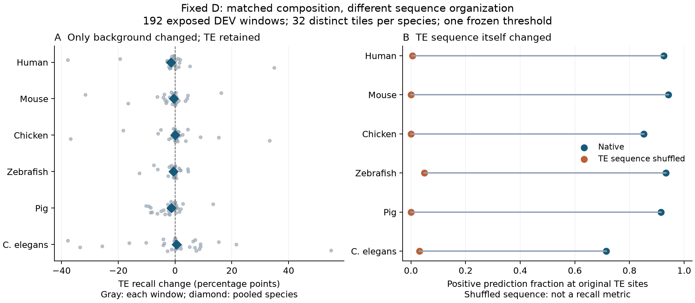

# Fixed-D paired sequence/context intervention

Job `12848734` completed: 192 exposed-DEV windows, six species, 32 distinct tiles per species, three arms. Native inference plus loading took 258.05 seconds. No training, calibration refit or sealed data.

| Species | Native TE recall | BG shuffle Δrecall (pp) | Interior Δrecall (pp) | TE-shuffled original-site positive rate |
|---|---:|---:|---:|---:|
| human | 0.9252 | -1.505 | -1.369 | 0.0056 |
| mouse | 0.9420 | -0.467 | -0.385 | 0.0000 |
| chicken | 0.8515 | +0.033 | +0.747 | 0.0000 |
| zebrafish | 0.9336 | -0.550 | -0.366 | 0.0485 |
| pig | 0.9147 | -1.355 | -0.842 | 0.0000 |
| c_elegans | 0.7141 | +0.533 | +0.462 | 0.0312 |

The TE-shuffled column is **not recall**: the biological validity of the original TE labels does not survive this sequence intervention. It only describes predictions at the original coordinates.

Background-only shuffling leaves all TE bases, positions and window boundaries unchanged; all arms retain exact whole-window mono- and dinucleotide counts. The code checks these properties during execution. Hard-negative and unknown-labelled bases are protected. Scores use the frozen D Platt parameters and threshold 0.42330056285498807.

In these selected DEV windows, perturbing annotated background has a small pooled effect (-1.50 to +0.53 percentage points of TE recall), whereas perturbing the TE sequence itself causes a much larger decrease in original-site positive predictions. This supports sensitivity to TE-local sequence organization beyond mono-/dinucleotide composition. Higher-order k-mer patterns, internal context and more complex motifs remain alternative explanations; this does not prove evolutionary understanding, absence of memorization, or a foundation-model advantage over a k-mer learner.

Pooled averages hide local heterogeneity: 21/192 windows change by at least 10 recall percentage points under background shuffling, with individual changes from -37.85 to +54.88 points. Species-specific median absolute changes range from 0.44 to 4.65 points. Thus some loci are strongly context-sensitive; opposite-direction effects can cancel, and the small pooled effect must not be read as context independence. See the paired plot and every-window records.

The native recall values describe the fixed eligibility-selected subset, not the complete DEV panel. The result does not support treating surrounding-background context as an established explanation for the prior GARLIC benchmark failure. It does not rule out other context types, sequence-length effects, tokenization effects, or family-distribution shifts. There is no new independent test, hypothesis-test p value, or post-hoc alternative perturbation search.

See [protocol](../../docs/experiments/D-CONTEXT-PAIR-20260917.md), [per-species table](per-species.csv), [per-window native result](run-12848734/result.json), and [pre-inference selection](run-12848734/selection.json). All 192 windows are retained.

Figure source: `scripts/experiments/D-CONTEXT-PAIR-20260917/plot.py`; rendered with Matplotlib 3.11.2. PDF and SVG are provided beside the PNG.
