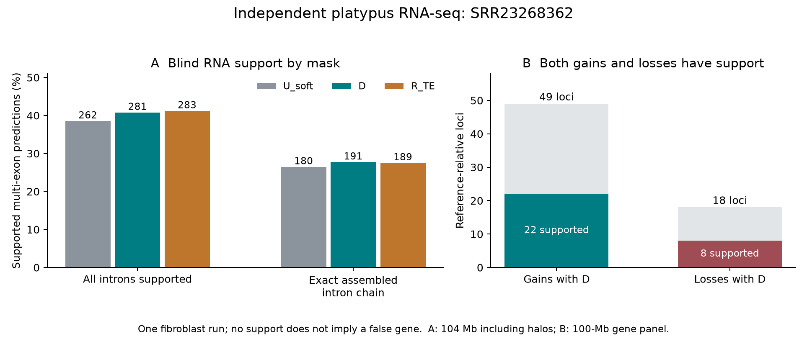

# Independent RNA evidence for platypus gene predictions

Native Slurm job **12858354 completed** in 34m34s (exit 0). The fixed study/run **SRR23268362** contributes 27,485,388 paired templates; HISAT2 reports **91.84% overall alignment** to the complete GCF_004115215.2 assembly. This produced 194,293 distinct junctions and 31,233 de novo StringTie transcripts.

The blind union contains **1,083 predicted exon chains**, selected from D, U_soft and R_TE without reading gene-reference correctness or RNA support. All predictions from twenty 5.2-Mb inference inputs are included: **104 Mb including halos**, whereas the historical reference-scored gene panel is **100 Mb**. These denominators must not be conflated. The raw-RNA primary analysis includes 975 multi-exon candidates; the other 108 single-exon candidates have no intron-support endpoint.

| Arm | All predicted chains | Multi-exon | All introns supported | Exact StringTie intron chain |
|---|---:|---:|---:|---:|
| U_soft | 754 | 680 | 262 (38.53%) | 180 (26.47%) |
| D | 762 | 689 | 281 (40.78%) | 191 (27.72%) |
| R_TE | 766 | 687 | 283 (41.19%) | 189 (27.51%) |

Strict support requires **each intron** to have at least three NH=1 primary templates, each with at least 8 aligned bases on both sides. Mates are counted once. Alignment/junction evaluation is strand-agnostic. StringTie used no reference GTF and is a second analysis of the **same RNA run**, not a separate assay.

## Post-hoc region sensitivity

Paired resampling of the ten chromosomes (10,000 draws, seed 42) was added after seeing native counts. It measures regional sensitivity, not independent biological replication or a prespecified confirmatory test.

| Comparison | Endpoint | Rate difference (percentage points) | 95% interval |
|---|---|---:|---:|
| D_minus_U_soft | all_introns_strict | +2.25 | [+1.00, +3.86] |
| D_minus_U_soft | stringtie_exact_intron_chain | +1.25 | [-0.16, +3.18] |
| D_minus_R_TE | all_introns_strict | -0.41 | [-1.29, +0.55] |
| D_minus_R_TE | stringtie_exact_intron_chain | +0.21 | [-0.48, +0.95] |

## RNA support of reference-relative gains and losses

The annotation was joined **after** blind RNA scoring. The following two comparisons have complete candidate coverage; historical comparisons against U_nosm, R_all or P3 are not claimed because those arms were not all in the blind union.

| Comparison | Reference-relative set | Loci | All introns supported | Exact StringTie intron chain |
|---|---|---:|---:|---:|
| D_minus_U_soft | gained_loci | 49 | 22 | 13 |
| D_minus_U_soft | lost_loci | 18 | 8 | 7 |
| D_minus_R_TE | gained_loci | 13 | 4 | 3 |
| D_minus_R_TE | lost_loci | 9 | 4 | 3 |

## Interpretation

D has more RNA-supported predicted chains than U_soft, and independent raw reads support **22 of the 49 reference-relative gains**. They also support **8 of the 18 losses**. This corroborates a useful gene-annotation effect with real tradeoffs; it does not validate every gained gene or establish superiority to RepeatMasker. D and R_TE have similar aggregate support.

This single adult-male fibroblast run cannot assess all tissues. No RNA support is not a false-gene label. Exact full exon-chain agreement is zero for all arms; predicted coding boundaries and RNA UTR endpoints differ, so the declared intron-chain endpoint is the relevant comparison. Junction support alone does not establish correct coding start/stop, gene function, or transcript strand. The study/run is later than the 2021 annotation inputs; a distinct biological individual is not established.

The primary native outputs are `result.json` and `evidence_by_candidate.tsv/json`. Raw reads and whole-assembly alignments remain on Baobab. The official source and independence qualification are in the experiment protocol.
