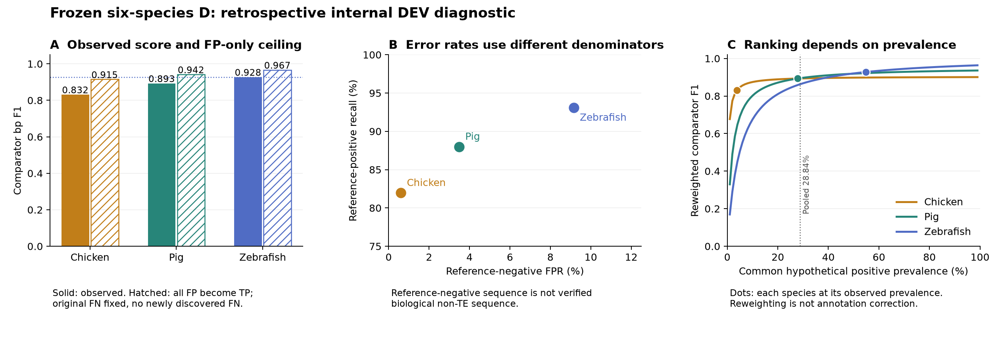

# 六物种D：斑马鱼高F1与注释完整性假设

2026-09-16。回顾性诊断，来源是已经观察过的seed42 D内部DEV，六物种每种500个8192-bp tile。六种均参与训练；既不是未见物种泛化，也没有定义“距训练物种的遗传距离”。未更改任何预测、标签、阈值、划分或冻结结论。

## 直接结果

| 物种 | 参考TE占比 | Precision | Recall | F1 | 参考负类FPR | FP bp |
|---|---:|---:|---:|---:|---:|---:|
| human | 46.96% | 0.951803 | 0.929091 | 0.940310 | 4.16% | 90,421 |
| mouse | 39.09% | 0.941088 | 0.942910 | 0.941998 | 3.79% | 94,374 |
| zebrafish | 54.83% | 0.924996 | 0.930694 | 0.927836 | 9.16% | 169,312 |
| pig | 27.85% | 0.906733 | 0.879945 | 0.893138 | 3.49% | 103,233 |
| chicken | 3.86% | 0.844189 | 0.819613 | 0.831720 | 0.61% | 23,887 |
| c_elegans | 9.56% | 0.834266 | 0.763958 | 0.797565 | 1.60% | 59,158 |

斑马鱼的precision较高，但参考负类FPR也最高（9.16%；猪3.49%，鸡0.61%），FP绝对量也最多。precision的分母是预测阳性，FPR的分母是参考负类，二者不能互换。参考负类未独立确认为生物非TE，因此这不证明斑马鱼生物误报最高，也不能从中估计漏注率。

### 阳性比例会改变物种排序

保持各物种的参考TPR和FPR不变，在共同假设阳性比例π下：

`precision(π)=π·TPR / [π·TPR+(1−π)·FPR]`

`F1(π)=2π·TPR / [π(1+TPR)+(1−π)·FPR]`

例如π=25%时，斑马鱼/猪/鸡分别为0.843976/0.886705/0.891942，原排序反转。保存了π=1%–99%的完整曲线，25%仅为展示点，没有选取部署先验或“最公平分数”。该算术分解显示原排序依赖组成，不量化真实生物学中prevalence的因果贡献，不校正注释，不隔离TE类别、divergence、长度、GC或阈值因素。不因看到排序改变而替换原F1。

另按三种合并的原参考阳性率28.8396%描述性重加权，斑马鱼/猪/鸡F1为0.863065/0.895095/0.893513；50%时为0.920433/0.919060/0.897871。该点由原分母决定，没有通过指标优化选取；同样不是公平部署先验或校正后真值。

### “全部差距只来自FP漏注”的极端上界

设只把原FP中的a个bp补注为TE，而原FN保持不变，也完全没有新增漏检：

`TP'=TP+a; FP'=FP−a; FN'=FN; 0≤a≤FP`。

最有利上界为`2(TP+FP) / [2(TP+FP)+FN]`。鸡即使100%原FP都得到TE确认，上限仍是0.914999，低于斑马鱼的当前0.927836。因此，该单一机制不能完全解释这两项固定DEV分数的差距。猪数学上可以达到，但至少需要72,733 bp（约70.45%的原FP）全部被确认为TE，且不新增任何FN。这不是实际支持率，更不是已救回的TP。

这个边界仅针对“补漏注，原预测和已有阳性不变”的假设。它不排除原阳性也有错误、边界变化、采样、模型漏检和TE组成的联合作用；也不证明斑马鱼标签完备。

更一般地，新增标签覆盖原FP中的a与原TN中的b时：

`F1'=2(TP+a) / [2TP+FP+FN+a+b]`。

新增覆盖一方面救回表观FP，另一方面暴露新FN；F1上升需要`a/(a+b)>F1_old/2`（a+b>0）。因此新参考不一定提高分数，必须同时报告a和b。

### 删标签机制演示的边界

本轮只生成分析性比例删标签表，未做随机抽样或原文件编辑。若以与模型输出独立的比例q保留原阳性，则期望计数为`qTP, FP+(1−q)TP, qFN, TN+(1−q)FN`；将期望计数代入时precision变为qP，recall不变。它说明漏标可以降低观测precision，却不能证明实际缺失率或谁更完整。真实遗漏通常按family/年龄/拷贝成组发生；这份简单机制表不能充当这种结构化缺失实验，更不能替代正交证据。

## 已有外部物种证据

| 对象 | 固定D结果 | 可支持范围 |
|---|---|---|
| 鸭嘴兽，4×1MiB | 原方向reference-positive recall 0.959325；比较注释F1 0.784126 | 局部、注释相对；生物precision/F1未定义 |
| 海胆，4×1MiB，补uncurated参考 | 844,932阳性bp，recall 0.428937 | 库覆盖缺口和D漏检并存；上下文变化混杂 |
| C. briggsae CB4，完整108.384Mb | 稀疏参考1,571阳性bp，覆盖972，recall 0.618714 | 不是全基因组真实准确率；precision/F1 null |

这三种没有参加D本次六物种监督微调，但backbone预训练/完整历史暴露未知，不能称完全未见DNA。海胆adapter是新的有监督域适配，不属于zero-shot。已有头部MoE只有有限bp收益，并伴随结构或保留性下降，不作为扩大MoE的依据。

## 最小下一步与停止原则

本轮[Pro聚焦讨论已完成](../../docs/manuscript/20260916/pro-species-review.md)，六种Dfam元数据已核实。历史三物种probe日志均明确curated-only，数目与本次查询相符。原D评估未保存逐位置缓存；新有限协议仅用同checkpoint、校准、原DEV重放推理，并在逐种原TP/FP/FN/callable精确复现后继续评分。三物种两库对照已提交，见[执行协议](../../docs/experiments/SPECIES-LIBRARY-CONTROL-20260916.md)；当前不预填结果。进一步的class/divergence/长度/GC共同支持分层需要空间/原注释证据，不能由当前汇总计数生成置信区间。

任何真实补注实验均保留原评价，输出全TP/FP/FN/TN转换，不只救回FP；匹配背景须不复用，并报告未匹配比例；独立证据审查须同时覆盖FP、TN和FN且隐藏模型分数。新RepeatMasker覆盖是比较器支持，只有超出同源参考共享来源的证据才可能支撑生物遗漏判断。若仅证实组成/边界/库敏感性，就以此结束，不扩为“斑马鱼注释更完整”的强结论。

Plant/Fungi没有本轮首训结果，建议作为独立后续方向，不能用新领域训练代替当前动物模型的证据闭合。植物需独立label/TE类别/嵌套和训练外clade设计；真菌还需区分存在或缺少RIP等机制的群体，不假定所有真菌同质。首次训练和新sealed面板须形成具体协议，不因本讨论自动启动。

## 实测Dfam库元数据补充

Slurm12743207已完成（1分18秒），同一已安装Dfam3.9（2025-03-10，FamDB2.0.0）对六种各查询curated/uncurated祖先及后代条目；目标相关分区无缺失报告。数据库整体有其他缺失分区，不能称安装了全部全球分区。

| 物种 | Curated祖先条目 | Curated lineage-specific | Uncurated祖先 | Uncurated lineage-specific |
|---|---:|---:|---:|---:|
| human | 1385 | 52 | 0 | 0 |
| mouse | 1353 | 27 | 0 | 0 |
| chicken | 218 | 0 | 0 | 177 |
| zebrafish | 249 | 1717 | 0 | 0 |
| pig | 784 | 0 | 0 | 3047 |
| c_elegans | 16 | 180 | 0 | 0 |

这提供了具体的参考知识条件不均衡线索：斑马鱼1,717条lineage-specific curated，猪/鸡为0；后两者分别有3,047/177条uncurated。祖先条目可以覆盖目标物种，0个lineage-specific curated不等于没有TE参考；更多条目也可能只是分类细分、冗余或真实多样性，不能直接排序完整度。

此项只读当前安装库metadata，并非对历史每次实际消费库的完整复放；历史六种均使用4.2.2、species参数、无custom-lib已有独立元数据。若开展curated-vs-combined注释比较，斑马鱼无额外uncurated可作为相同内容阴性对照（实际序列集合仍须导出时核实）；猪/鸡有可测试新增库内容。该对照不需新模型训练，也不需Plant/Fungi。

[原始stdout/命令/数据库版本](library-inventory-12743207.json)；[只读审计脚本](../../scripts/experiments/species_library_inventory_20260916.py)。没有读取基因组、模型、标签或sealed结果。

## 图与复现

[PDF](species_annotation_diagnostic.pdf)；[SVG](species_annotation_diagnostic.svg)。A为当前F1与极端FP-only补注上界，B为两个参考条件错误率，C为共同prevalence曲线；点为各物种原自然prevalence。均为汇总算术诊断，不是新模型结果或独立确认。

脚本：[计数推导](../../scripts/experiments/species_annotation_diagnostic_20260916.py)、[绘图](../../scripts/experiments/plot_species_annotation_diagnostic_20260916.py)。[原始计数](../../docs/experiments/CROSS-SPECIES-L1-UPSTREAM-20260904/seed42/D/dev_metrics.json)；[汇总](summary.json)；[全曲线](prevalence_sensitivity.tsv)；[比例删标签表](analytical_label_thinning.tsv)。检查了分母、原P/R/F1复算，以及重加权公式与直接加权混淆表的一致性。没有使用新seed或未读封存数据。

## 文献依据与区别

- [Dfam官方介绍](https://dfam.org/about)说明其历史重点包括斑马鱼等模式物种，且提供seed alignments、consensus和profile HMM；这使注释不均衡成为合理候选机制，却不证明本次danRer11优于susScr11/galGal6的真实完整度。
- [Hoen等，2015](https://link.springer.com/article/10.1186/s13100-015-0044-6)已讨论不完整参考会惩罚实际检出但未标注的TE。因此“参考会漏注”本身不是新发现；本项目应提供可测的贡献边界与受控差异。
- [Ou等，2019](https://link.springer.com/article/10.1186/s13059-019-1905-y)提供人工curated水稻库和跨物种方法比较，是未来植物域设计的起点，不是独立于RepeatMasker生成流程的完美真值。
- [Lorrain等，2021](https://academic.oup.com/g3journal/article/11/4/jkab068/6173990)研究真菌TE与RIP差异，提示未来真菌面板应覆盖不同基因组防御背景；不据此推断当前D的真菌表现。
